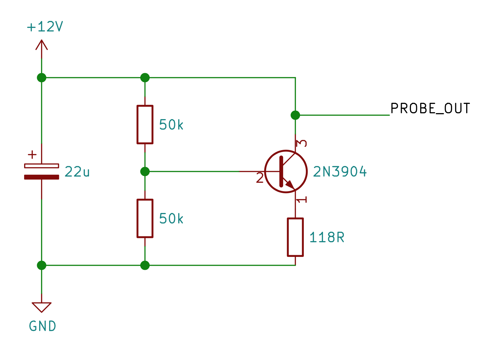
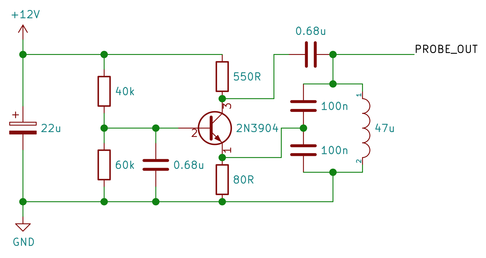
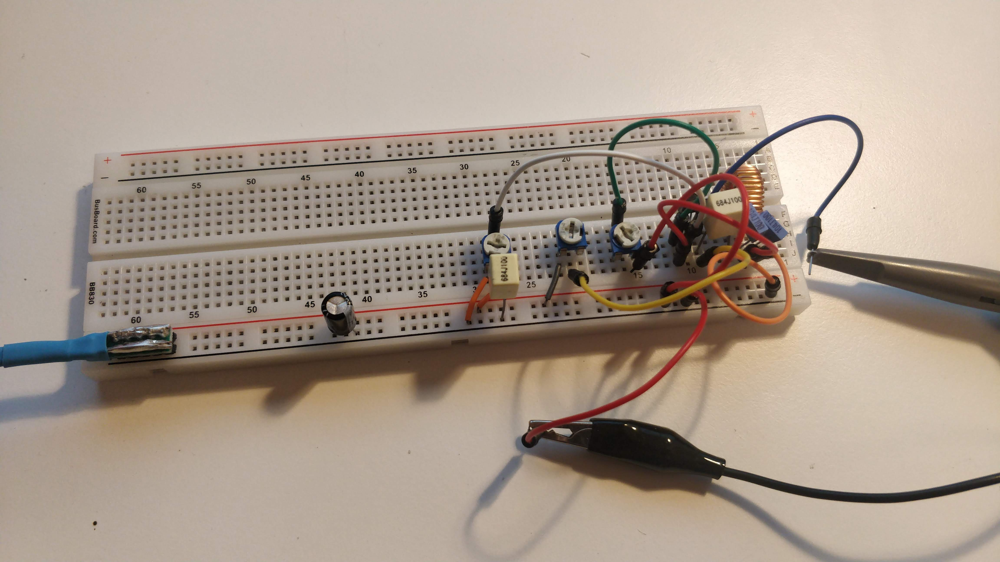
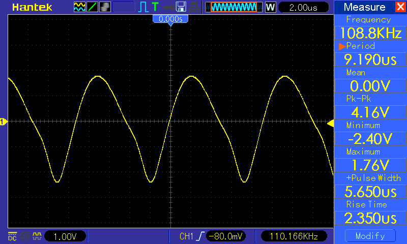
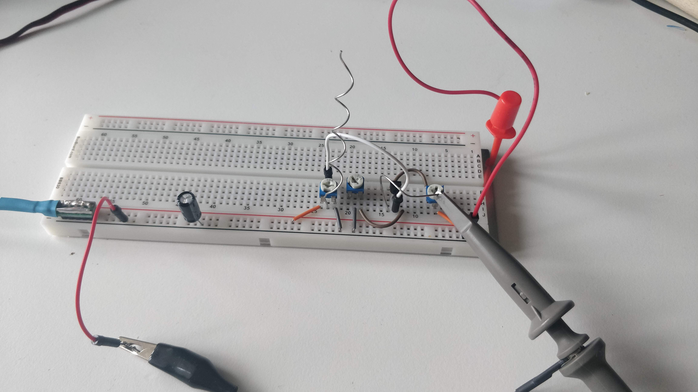
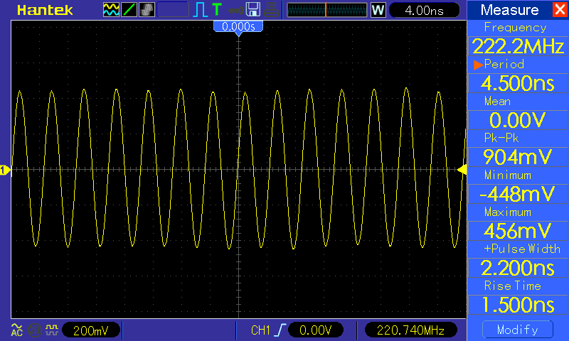

A quick puzzle - what is the waveform that you would see on the `PROBE_OUT` point of the following circuit?

 

It looks like a standard common emmiter amplifier biased with a voltage divider with no AC signal superimposed. However, there is no collector resistor - there is a direct connection from the probe point to the positive power supply, so if you guessed a constant +12V, you'd be right.

That is in theory at least. In real world however, the conductors and electronic components are not perfect, as we will see.

## Building an oscillator

A while ago I got myself my first oscilloscope, a [dual-channel Hantek DSO5202P](http://www.hantek.com/product/datasheet/dso5000p_datasheet.pdf) with 1 GSa/s sampling rate and 200 MHz analog bandwidth. It has served me very well, but most circuits I have been probing maxed out at around 5 MHz, so I was never able to push the limits of my oscilloscope.

Even most cheap arbitrary function generators do not go that high and I did not particularly want to invest into an expensive RF signal generator just to characterize an entry-level oscilloscope.
So I thought it would be a fun exercise to try to build an oscillator and see how fast it could get.

My starting point was, of course a standard [Colpitts oscillator](https://en.wikipedia.org/wiki/Colpitts_oscillator) and I put together this simple circuit with the components I had at home on a breadboard.

I got a sine-ish wave with the frequency of approximately 110 kHz. That was a nice start. The frequency of a Colpitts oscillator is determined by the following formula (assuming that the two capacitors in the LC tank circuit are the same)

$$
    f_0 = \frac{1}{\pi \sqrt{2 L C}}
$$

The formula predicts a value of 103.821 kHz, so the actual frequency I got was well within the tolerance of the components I was using.

## Getting to 100 MHz

In order to increase the frequency, I needed to reduce either the capacitance or the inductance of the tank circuit. I tried progressively smaller capacitors and I swapped the ferrite ring inductor for an air-core inductor (just a couple of turns of magnet wire). By doing so I was able to get to around 50 MHz. 

At some point while swapping the capacitors on the breadboard I realized that the circuit didn't actually stop oscillating when I removed them. In fact, the frequency *increased* by removing the capacitors. This was not a huge surprise, as it is a well known fact that breadboards have quite a [significant stray capacitance](https://wiki.analog.com/university/courses/electronics/electronics-lab-breadboard-coupling) between the rows, on the order of a couple picofarads between adjacent rows (parallel metal contacts with plastic as the dielectric). In a similar manner, the jumper wires have a small inductance that becomes quite significant at higher frequencies, so I was able to get rid of the discrete inductor too.

Doing so I was able to get to around 100 MHz by just removing both capacitors and the inductor from the LC tank circuit. Now - 100 MHz is in the FM radio band, so just for fun I attached an extra lead to the collector to serve as an antenna and attached the other oscilloscope probe in a loop to see how much signal is picked up. Turns out that quite a lot, around 400 mV peak-to-peak around 10 cm away.

")

Actually, I didn't even need to add an antenna, all the jumpers on the breadboard were antennas by themselves, all radiating significant EM energy all over the place. Just for fun, I tried to tune an FM radio to the same frequency and sure enough - I heard a clear 50 Hz hum at that frequency. I was actually able to receive the signal on the other side of my home too, so I got a bit worried. The frequency of the oscillator was not very stable, it drifted in the range of a couple megahertz. So I was probably jamming a couple of radio stations for my neighbors

The transmitted power was still tiny, so that much of an issue. Still, I was very careful to stay out of the 108–137 MHz band which is used for air navigation and traffic control.

## 200 MHz and beyond

My tank circuit was essentially all parasitic at this point, so I was running out of ideas as to how to make my oscillator even faster. I replaced some jumper wires with shorter ones, removed all the discrete capacitors and added a metal plate below the breadboard connected to circuit ground, finally resulting in the circuit from the puzzle at the beginning of this post. 

By carefully tweaking the trimmer potentiometers, cutting the leads to length and so on, carefully arranging and bending everything, the best frequency I got was 220 MHz with ~1 V peak-to-peak (in reality probably a bit more, due to attenuation by the probe and the oscilloscope itself, which both have a 200 MHz bandwidth limit). 

The oscillation was *very* unstable at this point and even seemingly irrelevant modifications such as moving the electrolytic cap on the left one position left or right on the power rails caused the oscillation to stop. The oscilloscope probe was actually an essential part of the circuit, by disconnecting it or by shortening the ground lead, the circuit would no longer oscillate (verified by looking at EM emissions with the other probe). 

## Conclusion

Even though this is a far cry from an actual characterization of the instrument, I was happy to be able to see that my oscilloscope is actually able to display a 200 MHz waveform. This is likely close to the limit of what I can achieve with the 2N3904, which has a [transition frequency of 250-270 MHz](https://www.sparkfun.com/datasheets/Components/2N3904.pdf) and since I was able to exceed the limit of the oscilloscope, it did not seem to make much sense to go further with a faster transistor. 

It is by no means a limit of what can be achieved on a breadboard, though. EEVblog forum has [an ongoing contest](https://www.eevblog.com/forum/projects/challenge-thread-the-fastest-breadboard-oscillator-on-the-mudball/) for a fastest breadboard oscillator and the leading contestant is currently [sitting at over 20 GHz (!)](https://hackaday.com/2020/07/01/breadboard-breaks-the-speed-barrier/).

In this particular case, parasitic capacitance and inductance came to my advantage, but in general, they really put a speed limit on breadboard circuits, since relying on parasitics makes it incredibly hard to maintain precise control. Another significant problem is that by using conventional breadboarding techniques, everything radiates EM. This is not an issue only with high speed digital and RF circuits, low speed analog circuits (e.g. audio amplifiers) also suffer from crosstalk and increased noise when realized on a breadboard.