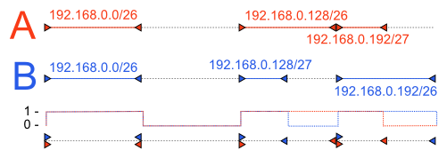

If we are connected to the internet via one single ISP, it is most likely that we will have a default route set up to one of their access routers. However, if we want to multi-home, either for reliability or load-balancing reasons, the most straightforward way is to set up BGP peering with our upstream providers. For example, if we connect to three upstream ISPs - A, B and C, there is no point in sending packets destined to one of B's (or its clients') IP addresses, to A or C. In order to make informed decisions on where to send packets, we will usually need to receive a full BGP feed so as to see the "whole internet" in terms of routing tables.

In the ideal world, we would see all the IP prefixes that are advertised in the internet, via all of our peers, leaving us to choose the best path, based on the AS path length and local preference. This is not always the case, though. Some routes will be missing in BGP feeds received from our upstream providers. That is - we will have some routes in our routing tables that are advertised only by some of our peers. These can be our other peers' internal networks (no-advertise/no-export), in which case we don't really care. If these routes, however, represent actual parts of the internet that should be reachable, this can be a cause for concern.

For example, if we only have two upstream providers and only one of them advertises a route to a certain network and the connection to that ISP is temporarily lost, that network will be unreachable to us.

## The problem

If there are routes missing that should not be, there is little that can be done other than escalating the issue to the problematic ISP. In order to do so, we must first identify the routes that are missing. By the time of writing this article, the global IPv4 routing table [has more than 400,000 entries](http://bgp.potaroo.net/index-bgp.html "BGP routing table statistics") and the number is expected to grow in the future. Therefore, we need a way to work with large collections of routes efficiently. The other problem is that due to different route summarization rules of our peers, routes may be split in different parts by different peers, so we cannot run a simple diff through all of our routing tables.

We would like to have a tool to perform a binary difference operation of two sets of IP address ranges (subnets) in an efficient manner. Ideally, the tool would also be able to perform other set operations, such as  union or intersection, so we can merge several ISP's advertised routes prior to comparing it with a single ISP's route table and so on.

What we want to achieve is perhaps best illustrated by an illustration: 

## Analysis of the problem

While making a tool like this, we would like to avoid pitfalls, such as using expensive binary trees, even though these may seem at first to be the most versatile and offer most flexibility while working with datasets. Since the IP address space is essentially a binary tree in itself, we can be tempted to model our internal representation of the route table by it. A quick calculation tells us that even if limit ourselves to networks with the maximum prefix length of /24, we would need

$$
    \sum _{n=0}^{24} 2^n = 2^{25}-1 = 33554431
$$

nodes or 384 MiB with 12 bytes per node (2×32-bit pointer, 1×32-bit address). This is workable with IPv4, but completely infeasible when dealing with IPv6 routes. We would like to allow for at least the networks with a maximum prefix of /48, yielding:

$$
    \sum_{n=0}^{48} 2^n = 2^{49}-1 = 562949953421311
$$

nodes or 16 PiB of data with 32 bytes per node (2×64-bit pointer, 1×128-bit address). Clearly impossible to hold in RAM by today's standards.

Fortunately, constructing a large binary tree can be completely avoided when performing this task and can in fact be done in $O(n)$ when the input routing tables are already sorted and usually $O(n \log n)$ when they are not, depending on the sorting algorithm.

## Algorithm

The algorithm used for comparison is very simple and as stated above runs in linear time. Suppose we compare two routing tables, A and B.

1. Iterate through all the entries in both routing tables and mark the start and the end of each subnet (_all-zeros_ and _all-ones_ addresses of a subnet). Insert both of them into a single array, while noting their type (_startA_, _startB_, _endA_, _endB_)
2. Sort the above array, ordered only by IP number.
3. Iterate through the array and keep two counters, say $c_A$and $c_B$_. _Each time, \_startX_ marker is encountered, increase $c_X$and each time _endX_ is encountered, decrease it. 
4. If we are in the region, where $c_A > 0 \wedge c_B = 0$, we have found a IP range that is in A but not in B.

The algorithm works well even with overlapping subnets, since the counter is simply going to be larger than one in that case. But even though the algorithm is simple, there are a few things to consider:

- If we want to aggregate the missing subnets for clarity, we should perform the action (print out the subnet, ...) when counter drops back to zero.
- If we do this, we should be careful with neighbouring subnets, since the counter may drop to zero on the boundary but rises again immediately afterwards.
- We should be careful when dealing with single-address subnets (/32 or /128), since the start and the end point are going to be the same.

The algorithm works for other binary set operations as well. If we want to produce a union of two sets ($A \cup B$), we should mark the regions where $c_A > 0 \vee c_B > 0$ and for intersections  ($A \cap B$), we use $c_A > 0 \wedge c_B > 0$ comparison kernel.

## Summing-up

I implemented the above algorithm, based on [this Stack Overflow answer](http://stackoverflow.com/a/11892761/267885 "Algorithm to produce a difference of two collections of intervals"), in a tool that can be used to analyse routing tables, called BgpCompare. It reads IP subnets from two input files and then outputs the result of a set operation to standard output. It uses regular expressions to capture IP addresses and prefix lengths, so it can work with a wide variety of different routing platforms' routing table dumps, just by providing a new regular expression.

BgpCompare is free and open-source software, licensed under LGPL licence. It is written in C++11 and comes with a handy header-only library for IPv4/IPv6 address manipulation (parsing, textual representation, arithmetics, ...).

The Git repo is available [here](https://github.com/tibordp/bgpcompare).
