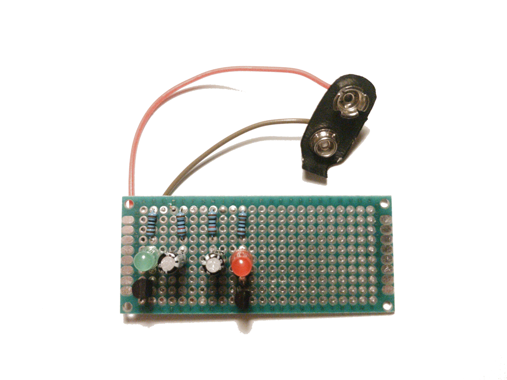
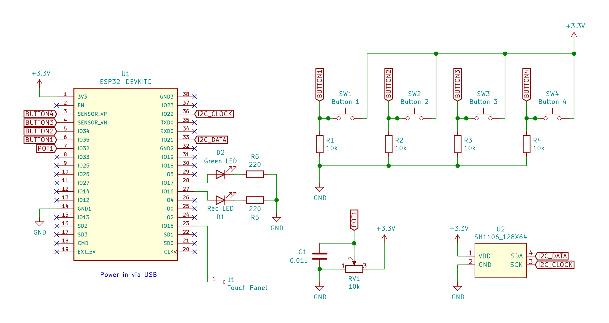
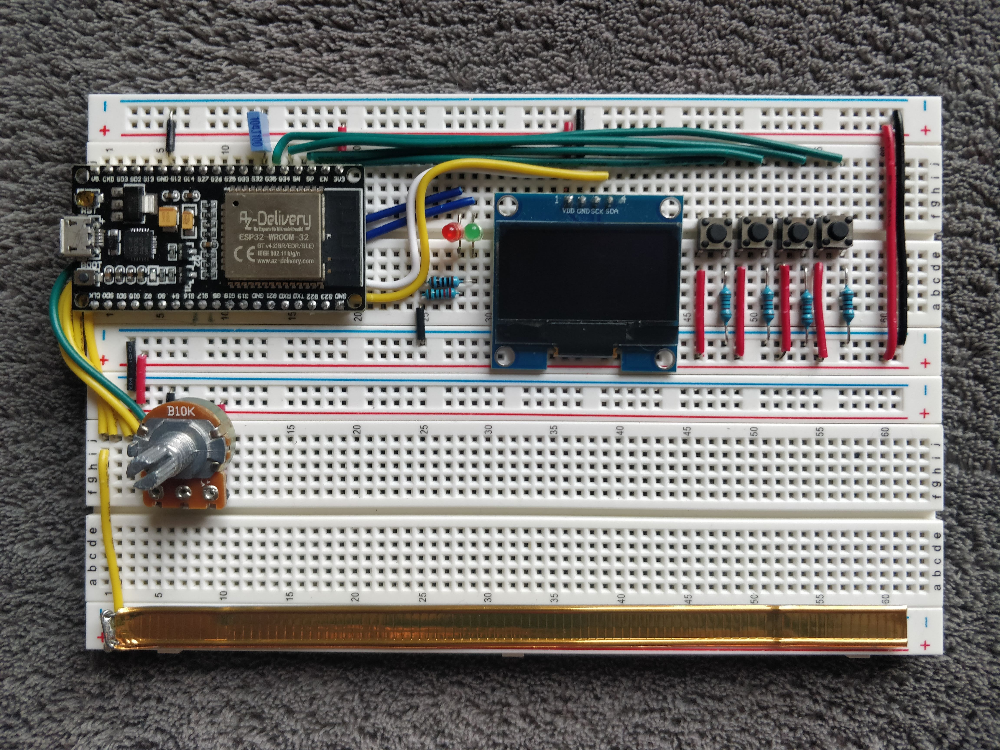
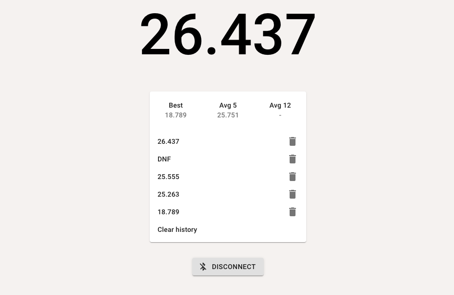

I had an electronics kit when I was a kid and I learned to do all kinds of electromechanical circuits and even some simple circuits with transistors, but I never completed a substantial electronics project. I recently got inspired by [Ben Eater's most excellent 8-bit breadboard computer series on YouTube](https://www.youtube.com/watch?v=HyznrdDSSGM&list=PLowKtXNTBypGqImE405J2565dvjafglHU) and decided that the time is ripe to get more into hobby electronics. After a bit of an Amazon shopping spree, I got myself the essentials, like a multimeter, a bench power supply, a soldering station, an large assortment of basic electronic components, some breadboards, perfboards and jumper wires and I put together this blinky "Hello, World!" to get back to speed with my neglected soldering skills and re-learn how bipolar transistors work.



I also bought an Arduino kit and by it, I had my first programmable microcontroller, a clone Arduino Mega. It turned out to be a lot of fun. After marveling at my first program running on something that does not have an OS, I also played a bit with the components from the kit (IR sensor, 7-segment displays, servos, steppers, ...), but then it was time to try to build something more substantial.

## About ESP32

While shopping for my new electronics lab, Amazon also recommended [this thing](https://www.amazon.co.uk/AZDelivery-NodeMCU-CP2102-Development-Parent/dp/B074RGW2VQ) to me. An Arduino-compatible board with Bluetooth AND Wi-Fi AND 240MHz clock speed *AND* you get three of them for just slightly over the price of a single original Arduino Uno? Sounded a bit too good to be true. I had never heard of ESP32 (which as it turns out is actually quite popular in the IoT space, especially [DIY home automation](https://esphome.io/)), but seemed really cheap so I gave it a shot. I also bought a set of 3 128x64 monochrome OLED displays from the same company, for similar reasons.

ESP32 is a SoC made by Shanghainese company Espressif based on the Tensilica Xtensa architecture. Its older brother [ESP8266](https://www.espressif.com/en/products/socs/esp8266) was initially meant as a Wi-Fi bridge for other microcontrollers, but as it is a rather powerful processor by itself, it quickly found use as a standalone module. Espressif provides [an Arduino core for ESP32](https://github.com/espressif/arduino-esp32), which is a set of wrappers around [ESP-IDF](https://github.com/espressif/esp-idf), the primary SDK for ESP32 programming. The whole stack is almost entirely open source, with the exception of the Wi-Fi and Bluetooth drivers, which are distributed as binary blobs ([1](https://github.com/espressif/esp32-wifi-lib), [2](https://github.com/espressif/esp32-bt-lib)), which along with great documentation makes it really easy to see how things work under the hood of high-level Arduino wrappers.

I was able to quickly write a [small Wi-Fi enabled sketch](https://gist.github.com/tibordp/a9fe405bc8ffa2cb325502041faed60e) that calls a JSON API and display them on the OLED display the text in a scrolling fashion, reloading it on every loop using [U8g2 library](https://github.com/olikraus/u8g2) for drawing to the display.

Setting up Wi-Fi and making a HTTP call was as simple as

```cpp
#include <WiFi.h>
#include <HTTPClient.h>

HTTPClient http;

void setup() {
  WiFi.begin("5G COVID-19 Transmitter", "hunter2");
  while (WiFi.status() != WL_CONNECTED) {
    yield();
  }
}

bool fetch() {
    http.begin("https://api.chucknorris.io/jokes/random");                                   
    if (http.GET() == 200) {
        // see the body with http.getString();
        return true;
    } else {
        return false;
    }
    http.end();
}
```

I read a lot about embedded programming despite never doing any, and I maintain reverence for all its intricacies and pitfalls. All that said, Arduino is very accessible for beginners. A lot of example code just work on the first try and the the large ecosystem of libraries seem to just work. Even more surprisingly, even though most of the Arduino ecosystem is built around the AVR boards, I have not yet run into a situation where a library would not work on ESP32.

ESP32 also has some other nifty built-in peripherals. The one that stood out to me is a range of capacitive touch sensing pins. This gave me an idea to keep with the theme of [my previous project](/2020/10/neishauben/) and build a speedcubing timer *à la* [StackMat™ Pro](https://www.speedstacks.com/store/retail/speed-stacks-stackmat-pro-timer/) that is used in speedsolving competitions. 

## Touch sensor

StackMat timer's mode of operation is that you keep your hands on the pads and the timer starts as soon as you lift them off and then stops when touched again. This is done with a capacitive sensor, which in overly simplified terms works by applying an alternating voltage pattern on the electrode and measuring the propagation delay of the signal to a comparator. If the electrode is in close proximity to a human body, the capacitance increases and therefore the signal propagates slightly slower due to [RC delay](https://en.wikipedia.org/wiki/RC_time_constant). 

As capacitive sensing would be the center-piece of the project, it made sense to start with that. Arduino, again, makes this really easy. I connected the pin 15 of my ESP32 board to a aluminium foil pad with an alligator clip and tried this sketch.

```cpp
#define TOUCHPAD 15

void setup() {
    Serial.begin(115200);
}

void loop()
    int currentTouchValue = touchRead(TOUCHPAD);
    Serial.println(currentTouchValue, DEC);
    delay(10);
}
```

It worked nicely, the numbers got lower as my hands were in close proximity to the pad. The ESP32 also supports attaching an interrupt to the touch sensor to which triggers when the value falls below a certain threshold:

```cpp
#define TOUCHPAD 15

volatile bool touched = false;

void IRAM_ATTR onTouch() {
  touched = true;
}

void setup() {
    Serial.begin(115200);
    touchAttachInterrupt(TOUCHPAD, onTouch, 40);
}

void loop()
    if (touched) {
        Serial.println("Can't touch this");
        touched = false;
    }
    delay(10);
}
```

This was really promising, but I needed to have the capability to handle both touch down and touch up event. Unfortunately, there doesn't seem to be a way to get an interrupt on both falling and rising edge with Arduino SDK, so I resorted polling it timer with `touchRead` from the main loop to reset the flag once the touch sensor value rose above the threshold. This meant that touch down events were pretty much instantaneous, but touch up could be a bit delayed. I wanted my timer to have accurate timing, but this seemed good enough for a start. By introducing some hysteresis by setting the touch up threshold slightly higher than the touch down threshold, the noise was not a problem at all and I did not need any additional debouncing logic.

## State machine & drawing 

I modelled the cube timer program as a state machine that transitions on flags being set for buttons and the touch sensor, like in this stripped down example:

```cpp
#define TOUCHPAD 15
#define STATE_DEFAULT 0
#define STATE_INSPECTION 1
#define STATE_SOLVING 2
#define STATE_SOLVING_FINISHED 3

volatile bool touched = false;

void IRAM_ATTR onTouch() {
  touched = true;
}

void setup() {
    Serial.begin(115200);
    touchAttachInterrupt(TOUCHPAD, onTouch, 40);
}

int state = 0;
long solvingStarted = 0;
long solvingFinished = 0;

void stateMachine(long currentTime) {
    switch (state) {
        case STATE_DEFAULT:
            if (touched) {
                state = STATE_INSPECTION;
            }
            break;
        case STATE_INSPECTION:
            if (!touched) {
                solvingStarted = currentTime;
                state = STATE_SOLVING;
            }       
            break;
        case STATE_SOLVING:
            if (touched) {
                solvingFinished = currentTime;
                state = STATE_SOLVING_FINISHED;
            }     
            break;
        // Extra state to ensure we are not touching the sensor when going back 
        // to initial state, as that would immediately restart the timer.
        case STATE_SOLVING_FINISHED:
            if (!touched) {
                state = STATE_DEFAULT;
            }
            break;
    }
}

void loop()
    long currentTime = millis();
    stateMachine(currentTime);
    if (solvingFinished) {
        Serial.println(solvingFinished - solvingStarted, DEC);
        solvingFinished = 0;
    }
    if (touched && touchRead(TOUCHPAD) > 50) {
        touched = false;
    }
}
```

This worked well and I had a barebones, but functioning cube timer that reported the times to the serial port. Next I wanted to integrate the OLED display with the U2g8 library, which is where I hit another issue - maximum I2C clock speed was much lower than I thought it would be, so transferring the display buffer would take ~15 milliseconds. From the end user perspective, this is mostly imperceptible, but since I was also driving the state machine from the main loop, this would mean that the recorded times could be off by that much, which was unacceptable.

Thankfully, ESP32 also has [two hardware timer groups](https://docs.espressif.com/projects/esp-idf/en/latest/esp32/api-reference/peripherals/timer.html), which meant that I could handle the state machine and resetting of the touch sensor flag every millisecond, leaving the main loop just to handle the display.

```cpp
hw_timer_t * timer = NULL;

void IRAM_ATTR onTimer() {
  long currentTime = millis();
  stateMachine(currentTime);
  if (touched && touchRead(TOUCHPAD) > 50) {
      touched = false;
  }
}

void setup() {
    timer = timerBegin(0, 80, true);
    timerAttachInterrupt(timer, &onTimer, true);
    timerAlarmWrite(timer, 1000, true); /// Every 1000 microseconds
    timerAlarmEnable(timer);
}
```

This seemed to solve my problem and I decided to run with this approach. Note, however that it is not ideal. Timers run in an ISR context, which has a bunch of restrictions and gotchas. Also, they should run as fast as possible to avoid delaying other critical interrupt handlers. My state machine was relatively small, but `touchRead` is an expensive function, as it multi-samples the sensor to reduce noise. I would like to eventually rework the program to be entirely interrupt driven, though I think I'll have to ditch some of the nice Arduino abstractions and use [ESP32 API directly](https://docs.espressif.com/projects/esp-idf/en/latest/esp32/api-reference/peripherals/touch_pad.html).

## Hardware build

The timer is powered by a 3.3V coming out of the ESP32 board's regulator. I added 4 push buttons for various functions, 2 status LEDs and a rotary encoder for adjusting things like inspection time ands potential other uses. I had a lot of trouble with writing robust debouncing logic for the rotary encoder, so I eventually scrapped the approach and replaced it with a regular analog potentiometer. The signal from the potentiometer was also quite noisy, but a combination of adding a small capacitor between signal and ground, multi-sampling and hysteresis made it work really well (plus I like the smooth feel of analog potentiometers).

This is the schematic and the bill of materials

[](./images/schematic.svg)


- 2x breadboard
- 1x ESP32 DevKitC dev board
- 1x SH1106 128x64 I2C OLED display
- 4x push button
- 4x 10kΩ pull-down resistor for the buttons
- 1x red LED
- 1x green LED
- 2x 220Ω resistor for LEDs
- 1x 10kΩ potentiometer
- 1x 0.01μF capacitor
- 1x resealing tab from a bag of coffee beans 😇 (copper tape would be better, but I didn't have any)
- Some length of 22 AWG jumper wires of various colors

I started the build on breadboards, and as Ben Eater's breadboards look very pretty, so I tried my best to cut the jumper wires to length. I soon realized that the ESP32 board I had was too wide to fit on a standard one and still leave room on both sides to connect the pins, so I had to route some of the jumper wires under the board. I was inserting and removing the module a lot and I was really afraid that I would eventually snap it in half, so I decided to just connect some jumper extensions to all the pins I may need in the future and leave it in.

A funny coincidence is that the total cost of all the components ended up being around 15€, which is in the same ballpark as what commercial cubing timers go for.

This is the final result. Even though I wanted to solder it to a perfboard once finished, for it to be more permanent, I actually quite like how it turned out, so I'll probably keep it on breadboards for now.



## Adding Bluetooth

The rest of the build was straightforward, I added a bunch of features, like the ability to mark the result as a DNF or add a +2" penalty and a automatic calibration feature so the thresholds for the touch sensor can be set in the field by tapping the strip it a few times. This made it easy to connect the pin to an external pad and have it work well. I also considered adding some sort of persistence and a display of standard statistics (best time, average 5, average 12, ...). The problem with that idea was that even though the OLED display I used was great for displaying the time, it wasn't really big enough to be able to easily build a good user experience for complex interactions.

So, instead I wanted to use ESP32's another distinguishing feature and add Bluetooth integration, so that the solve history would instead be recorded on a more capable device, such as a smartphone and the timer itself would mostly be concerned with accurate timing, while still being usable as a standalone device. Also, as I am definitely not the first one to build an Arduino speedcubing timer, this makes the project slightly more original.

My first attempt was using the built-in BluetoothSerial library, based on this [example sketch](https://github.com/espressif/arduino-esp32/blob/master/libraries/BluetoothSerial/examples/SerialToSerialBT/SerialToSerialBT.ino). It was quite easy to integrate, but I started seeing random crashes on the controller after the initial setup. I suspected that my sketchy expensive timer ISR may have something to do with it (like messing up timing for the Bluetooth protocol implementation). I am still not completely sure what was the root cause, but switching the timer to use the second timer group solved the issue, so it's a likely explanation:

```diff
 void setup() {
-   timer = timerBegin(0, 80, true);
+   timer = timerBegin(1, 80, true);
    timerAttachInterrupt(timer, &onTimer, true);
    timerAlarmWrite(timer, 1000, true); /// Every 1000 microseconds
    timerAlarmEnable(timer);
 }
```

Now it was time to consider how the other side might look like. An Android app was an obvious choice, but I didn't necessarily want to build one from scratch. Then I saw that there is now a [Web Bluetooth API](https://developer.mozilla.org/en-US/docs/Web/API/Web_Bluetooth_API) so ideally I could have the timer logger implemented as a PWA. Unfortunately, Web Bluetooth API does not support classic Bluetooth, but only Bluetooth Low Energy, so BluetoothSerial would not work.

But, ESP32 had me covered there too. The chip supports Bluetooth Low Energy and the [BLE library](https://github.com/espressif/arduino-esp32/tree/master/libraries/BLE) is available and easy to use. The way Bluetooth LE GATT works is that a peripheral device (called server in standard Bluetooth terminology) exposes a set of "services", each of whose exposes a set of "characteristics". Each service and characteristic are identified by a 128-bit UUID (or a 16-bit alias for standardized services/characteristics). At each point in time a characteristic holds a particular value. For example, `2A37` is the standard UUID alias for a [heart rate characteristic](https://www.bluetooth.org/docman/handlers/downloaddoc.ashx?doc_id=239866), which has a 4 byte value, where the first two bytes are used for flags, and the lower two bytes for the current heart BPM.  

Each characteristic can have the following options on or off:
- *Read* - client can read (poll) the characteristic on demand
- *Write* - client can update the characteristic on demand
- *Notify* - server can notify the client when the value is changed
- *Indicate* - similar to notify, but it is Notify is fire-and-forget, whereas Indicate is acknowledged by the client

I wanted the Cube Timer to function like a simple sensor, which would notify the app when a new solve time has been recorded, but also the last value to be read on demand, which makes sense for it to be a characteristic. This is how an example server that exposes a counter characteristic would look like

```cpp
#include <BLEDevice.h>
#include <BLEServer.h>
#include <BLEUtils.h>
#include <BLE2902.h>

#define SERVICE_UUID         "EB0E77C3-AF14-4B7F-AC80-D3631DC386AC"
#define CHARACTERISTIC_UUID  "EB0E77C3-AF14-4B7F-AC80-D3631DC386AD"

BLECharacteristic *characteristic;
uint32_t counter;

void setup() {
  BLEDevice::init("CubeTimer");
  BLEServer *pServer = BLEDevice::createServer();
  BLEService *pService = pServer->createService(SERVICE_UUID);
  characteristic = pService->createCharacteristic(
                             CHARACTERISTIC_UUID,
                             BLECharacteristic::PROPERTY_READ   |
                             BLECharacteristic::PROPERTY_NOTIFY |
                             BLECharacteristic::PROPERTY_INDICATE
                           );

  characteristic->addDescriptor(new BLE2902());
  pService->start();

  BLEAdvertising *pAdvertising = BLEDevice::getAdvertising();
  pAdvertising->addServiceUUID(SERVICE_UUID);
  pAdvertising->start();
}

void loop() {
    characteristic->setValue(counter);
    characteristic->notify();
    counter++;
    delay(1000);   
}
```

Along with the last recorded time, I also wanted to expose the current state of the timer (idle, inspection, running) and I thought it would be cleaner to implement it as a separate characteristic, as it is really independent. However, I ran into some issues later on when I was implementing the web app, where it seemed to work fine in Chrome on laptop, but on my phone, it was failing with a cryptic `GATT operation failed for unknown reasons` error. So I settled instead on a single characteristic, with the format of a packed struct, and I notified on every transition of the internal state machine

```cpp
struct __attribute__ ((packed)) CharacteristicValue {
  // Internal state of the device  
  // (e.g. 0 = default, 10-19 = inspection, 20-29 = timer running)
  uint32_t state;    
  // Number that increments on every new solve, so we know whether the new value 
  // is a state change within the context of an existing solve or a new solve altogether
  uint32_t epoch;
  // Duration of the solve in milliseconds (DNF is represented as -1)
  int32_t duration;  
};
```

The next essential part was the web app itself. What I really wanted to do is to integrate it into [csTimer](https://cstimer.net/), which is one of the most popular speedcubing timer apps, is [open source](https://github.com/cs0x7f/cstimer) and most importantly, already contains integrations for both the trusty StackMat and a bunch of fancy Bluetooth smart cubes. It looked a bit complicated, so I opted to just write a small demo app with Create React App and Material UI with the csTimer integration to follow some time later.

[](https://tibordp.github.io/cube-timer)

## Conclusion

Building a physical gadget that ended up actually being usable was a great experience. While I consider the project finished for now, if I ever revisit it, I'd really like to design a proper PCB for it and have it built. If I get to that, I'd like to include a battery regulator and charging components, so it can actually function as a portable device. ESP32 has an ultra low power coprocessor, which allows for an idle state that draws minimal current, and it can wake up from it ether on a timer or an input interrupt, which would help extend battery life.

For my next electronics project, though, I'll probably try to play with less capable chips, like ATtiny85 or even build something out of 7400-series ICs like Ben. ESP32 is great and all, but with all its capabilities it feels almost as powerful as Raspberry Pi, which is awesome for actually building useful projects, but less exciting from the learning perspective, as the Linux environment makes it a lot like programming for powerful servers, PCs and smartphones. And as the retro games and the demoscene nicely demonstrate, constraint is the mother of invention. Of course there is a sweet spot abstraction layer to be found for everyone, and I think I have settled in mine, at least professionally, I do think it's important (and fun!) to have at least some familiarity on all the levels, from the serverless programming frameworks down to actual silicon.

Of course, whole source code is [available on GitHub](https://github.com/tibordp/cube-timer), both for the Arduino code and the demo app. And finally, here's a small demo of the whole thing

`youtube: G7zfDGPaEZs`