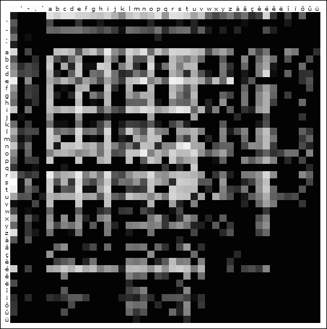

Generating faux words (words that look and sound like they could be a part of the language) is an interesting problem. Different languages have variously complex phonetic and orthography rules, but the factors that contribute towards identification of a word with a specific language, often include:

- Balance of consonants and vowels,
- Well known prefixes (un-, dé-, ...) and suffixes (-tion, -ment, ...),
- Capitalization and word length (think German :-) ),
- Diacritics and special symbols (apostrophes, hypens, ...).

Some languages' rules regarding the look-and-feel of words are also more flexible than others'. Languages that have a long history of borrowing, such as English, typically have more relaxed rules and a word is more likely to be perceived as being a part of it. Of course languages that are well known to the person in question are harder to replicate than languages one is just vaguely familiar with. As a non-speaker, Japanese seems trivial to generate faux words for - just concatenate simple syllables of one consonant and a vowel and perhaps prefer a *y* in the second part of the word. For example: *nagibutaya*, a word I've just made up, looks very Japanese to me.

## First attempt

I set on a task to create a computer program that would generate faux words for the Slovene language, first by upgrading the simple algorithm I used for Japanese. I tired adding more rules, such as allowing consonants that can indeed stand together without a vowel in between (a famous example in Slovene is *čmrlj*, a word written without any vowels, meaning _bumblebee_). Also, I accounted for a few exceptions to those rules. The program was working, but the results were poor. Either the words were unpronounceable or they were not very Slovenian-sounding.

## Second attempt

I chose an alternative approach for the second attempt. Instead of trying to figure out the rules of a language's word form, I let the program figure it out for itself. I made a program in C++ that analyses a lexicon and constructs new word on the basis of information it gathered from it.

I chose a very simple metric. For each combination of two letters in the alphabet, the program calculates the probability of one following another in a word as well as probabilities of single letters to be the first or the last ones in a word. I used wordlists provided by WinEdt that can be found [here](http://www.winedt.org/Dict/).

Neighbouring letter analysis of the French lexicon. First row signifies the likelihood that a letter starts a word and the first column the likelihood that a letter ends it.

The next part, after having analysed the lexicon, was to generate new words. For this, again, a simple algorithm was used. Each letter was chosen with a weighted random function, based on the frequency table, such as the one visualised above. The results were quite surprising. Even though the algorithm was not sophisticated at all, words such as these (no cherry-picking was involved) could pass as being in French to unknowing observer:

inéesuqué, posesur, copler, amonct, teucutér, urdonsonta, bédispez, adélitéve, auisttete, fentais, ilèmera, lysses, irngeles, piécaramon

The results for English were slightly less convincing. This can be attributed to the fact that English allows for more different two-letter combinations than French (the visualisation would have many white squares), but they do not always work when combined into a longer word:

voy, cleme, plaonas, abiok, macleses, usodens, poshad, medistets, amubodg, oshongs, detccichre, ngreang, moodery

## Third attempt

The last attempt was not a new approach to the problem but merely an upgrade to the algorithm used in second attempt. As we have seen in the case of English, a simple frequency map of two-letter combinations is not always enough. A straightforward upgrade would be to account for mutiple-letter combinations. The metric used in this attempt was the probability of a single letter following a string of _n_ letters in a word. I experimented with various values for _n_. The results for English were amazing (_n_\=5):

centringall, unliner, goutflyings, mackinets, handbaggers, thirstlings, spungency, clatternum, ophiolitise, goutineer, brickmaw, prophetised, firmant, acronyism

The caveat of the bigger-_n_ approach is that many outputted words are actual words or could be by the language's standard word formation rules, such as compounding. When trying this approach with highly inflected languages, such as Slovene or Latin, there is a chance that very little actually new words will be formed as the program would just permute suffixes.

## Conclusion

This mental exercise is a prime example of how statistics on large datasets can greatly simplify complex problems. Even though the program possessed no actual rules of the language, it was able to generate words reasonably faithful to the language's feel. The same principle is used in machine translation where statistical algorithms significantly outperform those that do extensive and complex parsing, both in terms of fidelity and practicality.

The source code is available [here](https://gist.github.com/tibordp/b993f3c85f8bd5a74cafc1b0c0e9f589)
