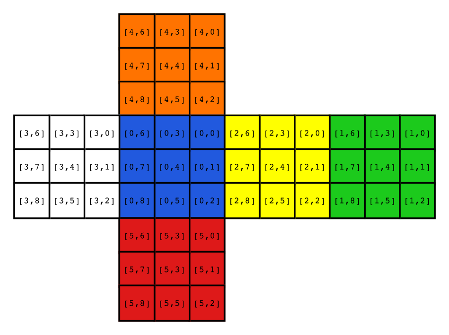

*TLDR: I finished a project I started a decade ago, a Rubik's cube solver and web UI, see it in action [here](https://tibordp.github.io/neishauben)*

## Introduction

In the summer of 2009 after my first year of high school I was on a vacation in Croatia with my family. I did not have access to the internet, but I did have lots of free time, an Asus EEEpc 701 with GCC installed and a physical Rubik's Cube. 

I thought it would be fun to write a program that could solve it. I had learned to solve the Rubik's Cube manually using Beginners Method (LBL) a couple of months earlier during what could be described as a bit of a speedcubing craze in my school, and as I wowed to first get my best time under one minute before proceeding to learn more advanced methods, that's all I knew, and that's what I chose to implement.

The first problem to solve was to figure out a way to represent a Rubik's Cube in memory. I ended up choosing a 6x9 array of integers 0-8, each integer representing a color of a face and the indices a position on the (somewhat arbitrary) net of a cube:



After that, I implemented the transformations of the Rubik's Cube representation for each of the possible operations (i.e.. *F*, *B*, *L*, *R'*, ...) and a bunch of machinery that allowed me to inspect the state of the cube in a position-invariant manner. After that it was a matter of implementing each step of the LBL technique until the cube was successfully solved. I took me around a week and the result was `rubiks.c`, consisting of [1200 lines of dense and largely unreadable C code](https://github.com/tibordp/neishauben/blob/dd9492f9e76b8366873ebd29e6bc3cdfe2143519/rubiks.c), but it was working, it could reliably solve any validly scrambled 3x3 Rubik's Cube.

## Adding a GUI

The original `rubiks.c` was a console application, that took a serialized cube and returned an algorithm as well as the serialized states for each step of the algorithm, like this

```bash
tibordp@persephone:~/src/rubiks$ CUBE_DATA="422400514324414530155025011332034450133243022213150551" 
tibordp@persephone:~/src/rubiks$ echo "$CUBE_DATA" | ./rubiks solve
L' F D2 B R2 D2 F' D' F | B' R B' R' B2 R B R' U B' U' B2 D B D' L B2 L' B2 L B L' B2 L' B' L | B' D B D' B' R' B' R B2 U' B' U B R B R' B' U B U' B' L' B' L D' B' D B L B L' | U R B R' B' U' | B' | U' B' U B' U' B2 U L' B' L B' L' B2 L | L2 B' L' B' L B L B L B' L | 
322000414124014030455425511332434550332342120213150551
403102402124014030455425120155434550332342233213150511
403102421204014030455425120055434551132042333212153513
403102421002310044212425120055434231455042333155153513
              ... many more steps ...
100100400522011011355322322233133144244244044331555555
300300300222111111555022022133133444022444444331555555
300300300211211211022022022133133133444444444555555555
000000000111111111222222222333333333444444444555555555
```

During initial development I wrote a small utility  `cubedraw.c` [(source here)](https://github.com/tibordp/neishauben/blob/dd9492f9e76b8366873ebd29e6bc3cdfe2143519/cubedraw.c) that took the serialized cube and drew it to a BMP file that I could inspect to see if my procedures produced sensible results. 

After the summer ended and I was back home where I had my PC, I also wrote a proper GUI for my solver cryptically named *Neishauben*. It was a Windows desktop application, written in Delphi and it looked like this


Fast forward to 2020, as I was scouring over my old code archives for inspiration, I had the idea to revive Neishauben and `rubiks.c`, clean it up, publish it on GitHub and write a blog post about it.

Pascal/Delphi was the first real programming language I learned (MSW Logo was technically the first one) and it was my go-to tool for making interactive programs until PC market share was in serious decline and HTML established its hegemony as the default presentation layer (in my mind that's around 2013 when Electron was initially released). 

For my first year or so of programming, I had a habit of deleting the source code once a program was finished and only keeping `.exe`s. By virtue of Microsoft's extreme efforts to maintain backwards compatibility, most of them still work. I do still have source code for Neishauben but I decided against resurrecting it, as:

 - I am very very rusty in Pascal. I haven't touched it in almost a decade.
 - Setting up a toolchain for Delphi would not be cheap or easy (though it seems [Embarcadero now finally offers a free community edition](https://www.embarcadero.com/products/delphi/starter))
 - Windows Desktop is a dead platform (fight me IRL).

## What if I put it on the web?

As I mentioned in my previous blog post, I do not consider myself a frontend engineer, so I consider `rubiks.c` a heart of this project and GUI just a sort of "necessary evil" in order to be able to showcase it.

Typically I'd write some API wrapper that would either shell out to `rubiks.c` or preferably link against it as a dynamic library and then I'd write some frontend around it in JavaScript. This however requires servers and since `rubiks.c` is a all computation and no storage or I/O, there's no fundamental reason why there should be a server somewhere.

So, the obvious answered seemed to be [WebAssembly](https://webassembly.org/). I had never worked with it, but the main selling point of tools like [Emscripten](https://emscripten.org/) is that code can be transpiled to asm.js or WebAssembly and run in browser largely unmodified.

So, I cleaned the code a bit first (`rubiks.c` used nested functions which are a GCC extension and do not work in Clang), then gave it a try:

```bash
tibordp@persephone:~/src/rubiks$ docker run --rm -v $(pwd):/src emscripten/emsdk \
    emcc -o rubiks.js rubiks.c
/src/rubiks.c:1512:1: warning: non-void function does not return a value in all control paths [-Wreturn-type]
...
/src/rubiks.c:1850:1: warning: non-void function does not return a value [-Wreturn-type]
}
^
5 warnings generated.
tibordp@persephone:~/src/rubiks$ node rubiks.js "scramble_n"
R' U' D L B2 F U F U2 D' R L U' F2 U L U2 L R2 L' R' F2 
452303041545212543314020335434131302150542210141552002
```

Wow, that was easy. `emcc` generated two files: `rubiks.wasm`, which is the actual compiled module and the `rubiks.js` which contains a bunch of glue code so that Node can interact with the compiled code. To be honest, I didn't expect it to work just like this, but then again, maybe I should not have been, since the C code is as simple as it gets as far as build is concerned (single file, no dependencies apart from `libc`).

## WebAssembly and Webpack

I considered writing the frontend in an old-school way (just plain HTML, JS and CSS, without the modern web toolchain), but I have become somewhat accustomed to the conveniences such as a package manager and `import`-ing libraries magically working without having to put a bunch of `<script>` tags into HTML.

So I ended up using NPM with its project structure and Webpack. Thing is: I have never set up a Webpack project from scratch, only ever through Create React App, Next.js and Gatsby.js. Also, I needed to find a way to integrate Emscripten into the build process. First Google result for `emscripten webpack` gave me [this nice Gist](https://gist.github.com/surma/b2705b6cca29357ebea1c9e6e15684cc), which conveniently solved both of my problems. 

I exported some functions from `rubiks.c`, for example this one that takes a Rubik's Cube representation and performs an operation on it (such as a front face clockwise turn):

```c
EMSCRIPTEN_KEEPALIVE
int perform(char* cube_data, int operation) {
	cube c_main;
	cube_read(&c_main, cube_data);
	cube_perform(&c_main, operation);
	cube_out(&c_main, cube_data);
	return 0;
}
```

The Javascript glue code for the above function looked like this:

```js
import rubiks from "./rubiks.js"; // Emscripten output
import rubiksModule from "./rubiks.wasm"; // Emscripten output
 
// I don't actually use ES top-level await,
// in reality, this is wrapped in an async function
const runtime = await rubiks({
    locateFile(path) {
        if (path.endsWith(".wasm")) {
            return rubiksModule;
        }
        return path;
    },
});

function performOperation(cubeData, operation) {
    var stackPtr = runtime.stackSave();
    var ptr = runtime.stackAlloc(54);
    for (var i = 0; i < 54; ++i) {
        runtime.setValue(ptr + i, cubeData[i]);
    }
    runtime._perform(ptr, operation);
    const result = [];
    for (i = 0; i < 54; ++i) {
        result[i] = runtime.getValue(ptr + i);
    }
    runtime.stackRestore(stackPtr);
    return result;
}
```

At this point I had an empty web page and I was able to call `performOperation` from Dev Tools. A very nice thing about Emscripten is that passing `-g` flag, as per the standard `cc` convention, debug symbols are included, which makes it much easier to debug segfaults in browser, as the location in original source code will show up in the console.

At this point I also refactored some of the `rubiks.c`. First I removed all `malloc`s and `realloc`s and replaced them with static buffers. This was not strictly necessary as Emscripten makes heap allocation work seamlessly, but I no longer trust my manual memory management skills and I thought it would be safer to not use the heap at all, but rather just stack space and static arrays.

I also fixed a couple of bugs I found along the way - middle plane rotation operations and whole cube rotations (*M*, *E*, *S*, *x*, *y*, and *z*) were slightly wrong (one of the faces ended up mirrored). Solver only uses basic face rotations, so this bug ended up hidden for a long time. I also fixed a bug that prevented the cube from being solved if the cube was in wrong orientation.

## Adding Three.js to the mix

Original *Neishauben* had a 2D net visualization of a Rubik's cube. This was alright at the time, but Rubik's Cubes' natural habitat is our 3D world, so I thought it would be nice to have a 3D cube in my GUI.

I have very little experience with the kind of computer graphics that gets done on a GPU, so I tried to find to see how hard it would be to use some library that takes care of the hard parts. [Three.js](https://threejs.org/) seemed to be the most popular one for 3D graphics, so I gave it a shot.

The whole project took me a weekend, but Three.js made it very easy to get started with the 3D representation of a Rubik's Cube. In just a couple of hours I was able to make a basic outline of a Rubik's Cube ([commit](https://github.com/tibordp/neishauben/commit/51c2b611a61c8450505a88276eb6496ff3ed65af)), then style the cube a bit and make the faces rotate around the pivot ([commit](https://github.com/tibordp/neishauben/commit/9d2d15ba2d06077be077418d47f4ccc50cf636c7)) and finally add faces to the pieces ([commit](https://github.com/tibordp/neishauben/commit/050f3fae9d7ce5fc9a57b3326bf4cd0a28906544)).

| Phase 1 | Phase 2 | Phase 3 |
|-|-|-|
|  |  |  |

Creating the faces on the cube pieces turned out to be the trickiest part. Each cube piece is identified by its coordinates (`x`, `y`, `z` being either -1, 0 or 1, with `[0,0,0]` being the center of the cube). We can determine the rank of the piece (center, edge, corner, middle of the cube) by the sum of the absolute values of the coordinates. E.g. `[-1, 1, -1]` has a rank of 3, so it is an corner piece. The faces are then identified with their own coordinates relative to the piece they are glued to and we want them to be facing outwards, so we can reuse the coordinates of the piece itself, but then set some zeros, so that at most one coordinate will be non-zero, like this:

```js
const faces = [];
for (var i = -1; i < 2; ++i) {
    for (var j = -1; j < 2; ++j) {
        for (var k = -1; k < 2; ++k) {
            // ...
            switch (Math.abs(i) + Math.abs(j) + Math.abs(k)) {
                case 0: // center of the cube
                    break;
                case 1: // center of the face
                    faces.push(createFace(i, j, k));
                    break;
                case 2: // edge
                    if (i == 0) {
                        faces.push(createFace(0, j, 0));
                        faces.push(createFace(0, 0, k));
                    } else if (j == 0) {
                        faces.push(createFace(i, j, 0));
                        faces.push(createFace(0, j, k));
                    } else if (k == 0) {
                        faces.push(createFace(i, 0, k));
                        faces.push(createFace(0, j, k));
                    }
                    break;
                case 3: // corner
                    faces.push(createFace(i, 0, 0));
                    faces.push(createFace(0, j, 0));
                    faces.push(createFace(0, 0, k));
                    break;
            }
            // ...
        }
    }
}
```

The next tricky part was mapping the faces to the internal cube representation of `rubiks.c`. I am sure there is some clever way to do it, but I mapped it by hand by always creating the faces in the same order, attaching some text labels to it and creating a permutation table corresponding, which happens to look like this:


I hope I never need to change it :)

The rest was quite straightforward. The pieces in the 3D model only move during the turn animation, then they snap back and faces are just re-colored using the `perform` method of `rubiks.c`. That way it is easy to find which pieces correspond to which operation, as they are always the exact same objects (just differently colored).

## Conclusion

I also integrated some controls, wrapped it into a PWA, made it prettier and published it on GitHub Pages. I decided to keep the name *Neishauben*, as a homage to the old Delphi frontend and also because it is very Googleable. It works on mobile too!

[](https://tibordp.github.io/neishauben/)

[See it live here!](https://tibordp.github.io/neishauben/)

This was quite a fun project! Of course, solving a Rubik's Cube using Beginners Method is by no means considered impressive, since I am sure that any other Rubik's Cube app worth its salt can solve it in an almost optimal way with at most ~20 moves. Nevertheless, I learned quite a bit about WebAssembly and in-browser 3D graphics as finally fixing a bug in `rubiks.c` that prevented the cube from being solved if it was rotated.

If I ever revisit Neishauben, here's a couple of things that I'd consider adding:

- Being able to manipulate the cube with mouse or touch (I imagine this being quite tricky, but I found [Three.js's `Raycaster`](https://threejs.org/docs/#api/en/core/Raycaster) which should be a good starting point)
- Being able to enter the initial state of the cube, making the app actually useful to people who found themselves with a scrambled Rubik's Cube not knowing how to solve it
- Display the algorithm of the solution somewhere.
- Make it into a reusable Rubik's Cube library (that's a bit of a stretch)
- More sophisticated solving algorithms (probably not)

For now, though, I consider it done, though it is [open source with an MIT license](https://github.com/tibordp/neishauben), so feel free to fork it and build something awesome!