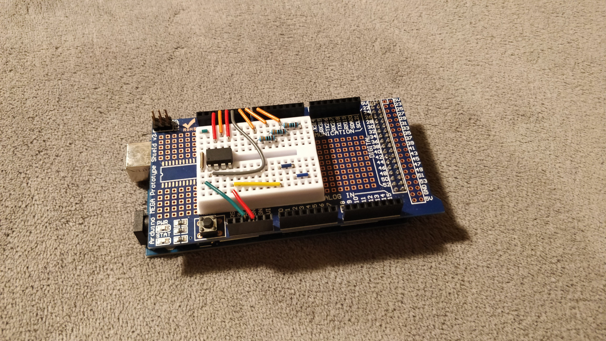
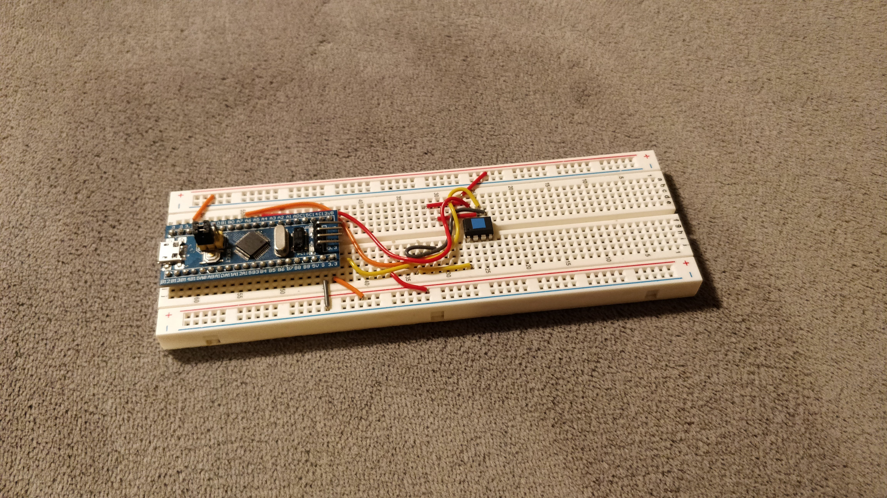
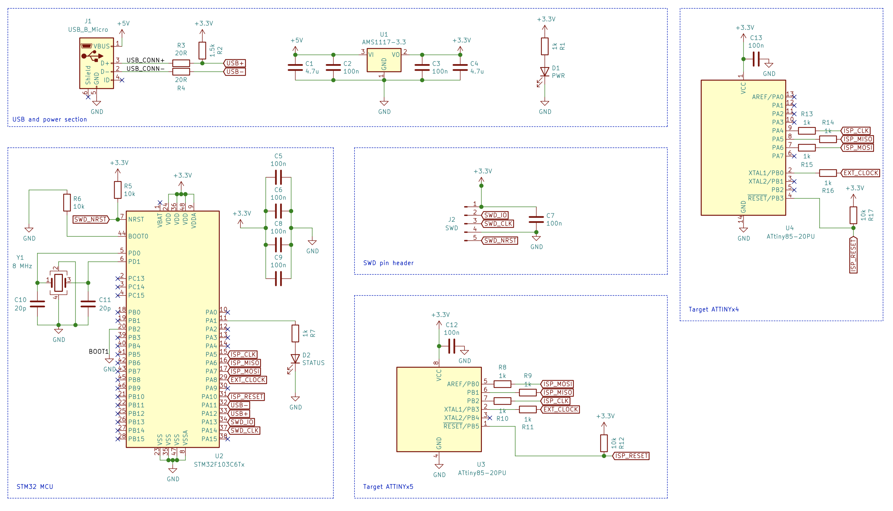
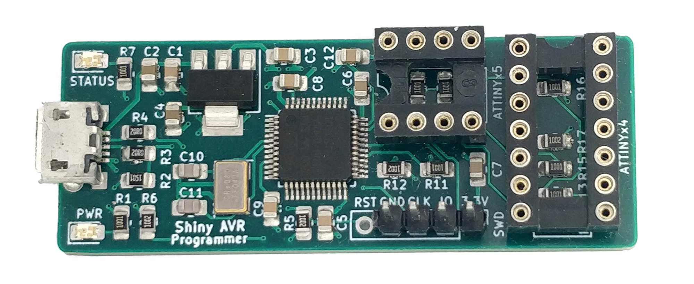

As I mentioned in [the previous blog post](/2020/11/esp32-cube-timer), I wanted to try doing a project with the [ATtiny85 microcontroller](https://www.microchip.com/wwwproducts/en/ATtiny85), which is popular in the hobbyist circles as an gentle pathway to moving beyond ready-made Arduino boards, as it is based on the same AVR architecture, has solid [Arduino framework support](https://github.com/SpenceKonde/ATTinyCore), is quite forgiving to work with and packs quite a punch performance-wise despite only having 5 fully-functional I/O pins.

So far I have completed a couple of small projects, such as [a coffee/kitchen timer](https://github.com/tibordp/coffee-timer) and a [voltage feedback PWM controller](https://github.com/tibordp/shiny-pwm) for DC/DC converters that uses the built-in PLL of ATtiny85 allowing it to switch at high frequency (up to 64 MHz, though the resolution gets worse beyond ~250 kHz).

## Arduino as ISP

ATtiny85 can be programmed from the Arduino IDE, but as it is a bare IC, the process is slightly more involved than just plugging in the USB cable and uploading the firmware - it requires an external programmer. Almost all AVR microcontrollers - ATtiny85 included - can be programmed with so-called *ISP (In-System Programming)*, which is a serial protocol based on SPI and there is a wide variety of programmers available. A popular way to program AVR chips that does not require buying a discrete programmer is [Arduino as ISP](https://www.arduino.cc/en/Tutorial/BuiltInExamples/ArduinoISP).

Following [this tutorial](https://www.instructables.com/Arduino-ISP-to-ATTiny85/) I was able to turn my Arduino Mega and the prototyping shield into a working ATtiny85 programmer. 



It worked well, but it had a rather annoying quirk - avrdude would often fail to sync during the firmware upload and the Arduino had to be reset, after which the upload would succeed. 

When plugged in via USB, Arduinos present a virtual serial port to the host, which has a dual purpose - it is used for programming the Arduino as well as for communication between the host and the application that is running on it. I thought that this dual use of the serial interface may be the reason, so figured I would try another Arduino-compatible board that I had, the STM32 Blue Pill. STM32 also comes with a USB interface, but unlike ATmega-based Arduinos, there an external USB to UART bridge is used, the USB data lines are wired directly to the target microcontroller. The default way of programming the Blue Pill boards is with an external ST-link programmer, so USB is under full control of the application running on the board and can be used to implement e.g. a HID device or a fully custom USB protocol.

I configured my Blue Pill with a USB CDC virtual serial port and then tried uploading the Arduino ISP sketch to it. To my surprise it worked on the first try without any modifications! I found this very surprising, since STM32 is a family of microcontrollers based on ARM Cortex-M rather than AVR architecture. It is a testament to the portability of the Arduino framework and the effort that goes into maintaining [forks for non-AVR hardware](https://github.com/stm32duino).



The issue with having to reset the programmer during upload was also gone and since I preferred the smaller form factor of the Blue Pill which snaps nicely onto a breadboard, I didn't bother with the Arduino Mega anymore. 

## A quick note about PlatformIO

At some point during my journey into embedded programming I discovered [PlatformIO](https://platformio.org/) which is a really awesome toolkit/IDE for a wide variety of embedded platforms. Compared to Arduino IDE, which is very bare-bones, PlatformIO integrates with popular IDEs, such as Visual Studio Code and it allows for projects to follow modern software development practices easily and is in general one of the nicest IDEs for C and C++ that I've used so far.

I really like that it is cross-platform, its dependency management, the ease of adding CI with Github Actions and the ability to multi-target the projects for multiple platforms. Arduino can be used as a framework, but it also supports different frameworks for a target platform, such as plain AVR-libc for AVR or ESP-IDF for ESP32. It is also very easy to import Arduino sketches, turning them into a project structure that is amenable to source control. I highly recommend it for outgrowing the Arduino IDE.

## What lies beyond breadboards?

Since its debut a couple of months ago, my home electronics lab has grown considerably. By far the best addition to it has been an oscilloscope. Being able to see the waveform made made debugging circuits much easier, but also gave me the courage to venture beyond Arduino-like dev boards, pre-built modules into the realms of analog and power electronics waters by building high-speed oscillators, amplifiers and switching power supplies. 

Unfortunately, this is where breadboards start to show their limits. First one is the current rating. Jumper wires start melting really quickly once a few amps start passing through them and even with high quality breadboards, there is a significant voltage drop across the power rails. 

The other one is noise and crosstalk. I heard a joke recently: *There are two types of electrical engineers: Those that design antennas, and those who don't realize they design antennas.*  With breadboards it is painfully true that every jumper is an antenna when high speed switching is involved. Even with careful layout it is difficult to avoid crosstalk and all the parasitic capacitances and inductances make life quite difficult.

Realizing circuits on a perfboard gives you a lot more freedom both with high currents and with noise in general. However, laying out solder traces on a perfboard is cumbersome plus there are a bunch of fancy ICs that only come in fine pitch SMD packages, which are next to impossible to wire on a perfboard without breakout boards.

All in all, it seems like the obvious choice is to learn how to design a proper PCB and making an AVR programmer seemed like a great first project since it would be actually useful and also since I already had a working breadboard prototype, which made the design process much easier.

## Designing the schematic

I recently watched [Phillip Salmony's excellent tutorial on KiCad](https://www.youtube.com/watch?v=C7-8nUU6e3E) where he goes through the whole process of designing a circuit around an STM32 microcontroller, selection of components, layout and routing and preparing the Gerber and other files required for fabrication and assembly. He also goes through best practices and common mistakes in layout and routing. 

I decided to use [KiCad](https://kicad.org/) for the circuit design. My starting point for the design was [the reference schematic for the Blue Pill board](https://stm32-base.org/boards/STM32F103C8T6-Blue-Pill.html). I mostly copied it, but I made a few changes:

 - Replaced the voltage regulator with AMS1117 in a SOT-223 package, to give me some more headroom maximum current-wise. 
 - Replaced the pull-up resistor on USB+ data line to a 1.5kΩ to +3.3V (was 4.7kΩ to +5V). This is in line with the [USB specification](https://www.beyondlogic.org/usbnutshell/usb2.shtml) for identifying the device as a full-speed USB. Some STM32 microcontrollers [have this pullup resistor](https://www.st.com/resource/en/application_note/dm00296349-usb-hardware-and-pcb-guidelines-using-stm32-mcus-stmicroelectronics.pdf) internally to be able to control the speed identification in firmware, but STM32F103 does not.
 - I tied BOOT0 and BOOT1 pins to ground as I only planned to program this device with via SWD, which does not require any changes to the boot selectors.
 - I skipped the 32.768 kHz crystal as the programmer does not require a real-time clock.
 - I replaced all passive components with 0805 ones, for the ease of soldering them manually.

Now that I had a basic "boilerplate" for a STM32 based board, I added the specific bits that would allow me to program ATtiny85s. This was fairly straightforward:
 
  - I connected the appropriate ISP pins (MISO, MOSI, SCK) of the target ATtiny to the SPI pins of the STM32. 
  - For the reset line, I just chose a random GPIO pin.
  - I decided to add another connection to ATtiny85 external clock input in order to be able to program ATtiny85s that have fuse bits set so as to require an external clock.
  - I added 1kΩ resistors on all data lines between STM32 and ATtiny85. If it happens that both STM32 and ATtiny85 have the pins set as outputs and they are in opposite logical state, this could cause high current to flow, damaging one or both chips. This was not strictly necessary, as Arduino as ISP has all the pins set to high impedance (input) before the target AVR chip is brought to programming mode via the reset pin. It is still a good idea though as it can happen that the programmer is unable to reset the target for various reasons.
  - I added a status LED.
  - I threw in another DIP socket for the ATtiny84 for good measure, with all data lines wired in parallel with ATtiny85, but with its own protection resistors. 

 

## Layout and routing

I decided to lay the board out on a 4-layer board with signals on outer layers and a ground and a power plane in the middle. This mostly took a lot of trial and error in order to get the board to be relatively compact. Philip Salmony's tutorial came very handy in this part, but so did [Rick Hartley's *How to Achieve Proper Grounding*](https://www.youtube.com/watch?v=ySuUZEjARPY) and I tried to work within these constraints in rough order of priority:

- All signal lines should have an unbroken reference plane below them
- Decoupling capacitors and the crystal should be as close as possible to the microcontrollers
- Crystal resonator should have its own ground plane island below, connected to the main ground plane at a signal point. 
- No high-speed digital signals near the crystal resonator
- Multiple small vias are better than a single large via.

I routed the USB data lines as a differential pair, though I did not bother with skew matching and controlled-impedance traces, as I figured that it should not really matter over such a short distance and with high-speed USB, which is just 12 Mbit/s.

") 

Some kind folks from the [r/PrintedCircuitBoard subreddit](https://www.reddit.com/r/PrintedCircuitBoard/) were kind enough to review my design after I was finished with it and I incorporated the feedback - mostly around placement of passive components and USB termination.

## Fabrication and assembly

I had my boards fabricated by [JLCPCB](https://jlcpcb.com/), as they have amazingly low prices and fast turnaround for small-volume prototypes. I paid $14.00 for 10 boards + shipping and I received the boards within the week. JLCPCB also offers SMD assembly and as I was a bit intimidated by the prospect of soldering tiny SMD components, I wanted to avail of it at first. I changed my mind by the time I placed the order as I figured it would be a good idea to learn this skill too. So I ordered the components from Mouser instead.

Turns out my fears regarding SMD soldering were unfounded. I bought solder paste, flux pens and a hot air station and it turns out that SMD components are in many ways easier to solder than through hole components. The surface tension of the solder paste helps the components to self-align on the pads, so dispensing an appropriate amount of paste, roughly placing the components and heating them up with hot air is all it really takes. Plus - it's easier to rework if you make a mistake, some hot air and you can remove the whole component. De-soldering DIP sockets is much more difficult in comparison.

For the first board, I assembled it in stages, testing the functionality at each point - I started with the USB socket, the voltage regulator and all the passive components in the power section. The power LED turned on when I connected the USB cable. The next part was the crystal with its load capacitors and the microcontroller with all the decoupling capacitors and pull-down resistors, which was a bit harder to verify, as it had not been programmed yet, so it wasn't doing anything. I tried probing the pins of the crystal oscillator, but I didn't see anything there yet. So I continued with the DIP sockets and the SWD pin header, after which I connected it to ST-link and it was recognized! After I uploaded the firmware, I was able to see a nice 8 MHz sine wave, so it seems like STM32 uses an internal RC oscillator when blank from the factory.

Here is the final result in all its shininess 

  

## Firmware and testing

The firmware was largely unmodified [Arduino as ISP sketch](https://github.com/arduino/arduino-examples/blob/main/examples/11.ArduinoISP/ArduinoISP/ArduinoISP.ino). I just adapted it for the pins I used, cleaned up the pre-processor directives a bit, since it only needed to support a single board and added the support for providing 16 MHz external clock.

The final part and the one I was most concerned about is the USB. I was very happy to see that my computer recognized the device, so it was time for an ultimate test - programming a ATtiny85. I put a blank ATtiny85 into the socket and tried to upload some sample code

```bash
tibordp@persephone $ avrdude -P/dev/ttyUSB0 -b19200 -p attiny85 -C /home/tibordp/.platformio/packages/tool-avrdude/avrdude.conf -c stk500v1 -b 19200 -e -D -U flash:w:.pio/build/attiny85/firmware.hex:i

avrdude: AVR device initialized and ready to accept instructions

Reading | ################################################## | 100% 0.00s

avrdude: Device signature = 0x1e930b (probably t85)
avrdude: erasing chip
avrdude: reading input file ".pio/build/attiny85/firmware.hex"
avrdude: writing flash (472 bytes):

Writing | ################################################## | 100% 0.47s

avrdude: 472 bytes of flash written
avrdude: verifying flash memory against .pio/build/attiny85/firmware.hex:
avrdude: load data flash data from input file .pio/build/attiny85/firmware.hex:
avrdude: input file .pio/build/attiny85/firmware.hex contains 472 bytes
avrdude: reading on-chip flash data:

Reading | ################################################## | 100% 0.24s

avrdude: verifying ...
avrdude: 472 bytes of flash verified

avrdude: safemode: Fuses OK (E:FF, H:DF, L:D1)

avrdude done.  Thank you.
```

Thank *you*, avrdude!

But then I tried to test the ATtiny84, which is where the disaster struck. No matter how many times I tried, `avrdude` just wouldn't recognize the chip. I tested continuity with multimeter and it seems like everything was connected properly, so I went back to the schematic. Turns out I miswired the MOSI line to pin 6 instead of pin 7 of the ATtiny84 DIP socket (pin 6 is [`PA7`, 7th pin of I/O port A](https://github.com/SpenceKonde/ATTinyCore/blob/master/avr/extras/ATtiny_x4.md), hence the confusion). Luckily it was easy to fix by cutting of the pin 6 of the DIP socket and bodging a small jumper between the holes 6 and 7 on the board. 

Then everything worked and I had a working programmer for ATtiny85 and ATtiny84 (should also work for ATtinyx41 family, but I have not tested it, since I don't have any on hand). 

## Conclusion

Over the next two weeks I assembled 4 more boards until I ran out of crystal oscillators. I got progressively better at it and by board 5 I was able to get the whole process down to 10 minutes. I learned a lot through t

