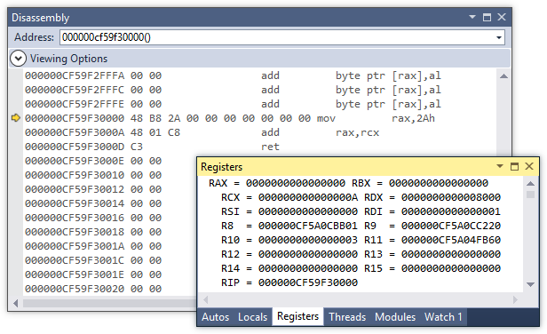

When we are designing a programming language, we generally have to decide whether it will be compiled or interpreted. Compilation has the obvious benefit of producing code that is even orders of magnitude faster than the purely interpreted counterpart. On the other hand, interpreters tend to be more easily implemented, since we can implement them in a high-level programming language without knowing the platform specific details, such as the machine code, ABI and the executable format. It also allows for easy introspection, dynamic typing, `eval` statements et cætera. JIT (Just-in-time) compilation combines the benefits of both. When code is compiled as needed we retain the flexibility of interpreted languages along with the speed of compiled code.

In this article we will make a simple JIT compiler for parametrized mathematical expressions for x86-64 platform, written in C++.

### Reverse Polish notation

(1 + 1) \* (2 / 3) in standard notation corresponds to 1 1 + 2 3 / \* in RPN

Expressions in the [reverse Polish notation](http://en.wikipedia.org/wiki/Reverse_Polish_notation "Reverse Polish notation") are more natural for a computer than the standard infix notation, since they are evaluated using a stack, which is a ubiquitous data structure. The other reason I chose RPN is that I have a special affinity for it, having designed [a programming language based on it](https://github.com/tibordp/stutsk). The evaluation algorithm is very simple:

1. Read the tokens (numbers, operators) one by one
   1. If the token is a number, put it on the stack
   2. If the token is an (binary) operator, pop the two topmost elements off the stack, perform the operation on them and push them back on the stack
2. If the expression is well formed, the stack will contain only one element which will be the result

A simple RPN evaluator for parametrized RPN expressions can thus be written like this (we could use `std::stack` but we deliberately avoid heap allocation for now):

```cpp
double rpn(char const* expression, double x)
{
    array<double, 128> stk;
    int depth = 0;

    for (; *expression; ++expression)
    {
        if (depth >= 127)
            throw runtime_error("Too much nesting");

        if (isdigit(*expression) || (*expression == '.') ||
            (*expression == '-' && isdigit(*(expression + 1))))
        {
            char* new_expression;
            stk[depth] = strtod(expression, &new_expression);
            expression = new_expression;
            ++depth;
        }
        else if (*expression == 'x')
        {
            stk[depth] = x;
            ++depth;
        }
        else if (*expression > 32)
        {
            switch (*expression) {
                case '+': stk[depth - 2] += stk[depth - 1]; break;
                case '*': stk[depth - 2] *= stk[depth - 1]; break;
                case '-': stk[depth - 2] -= stk[depth - 1]; break;
                case '/': stk[depth - 2] /= stk[depth - 1]; break;
                default: ;
            }
            --depth;
        }

        if (*expression == '\0')
            break;
    }

    return stk[0];
}
```

Straightforward enough, the problem is that this evaluator is relatively slow since it has to parse the expression string every time evaluates the expression. For example - on my laptop (Intel Core i7 2640M @ 2.8 GHz), it takes around 9.5 seconds to evaluate an expression with 100,000,000 tokens. Of course this can be made significantly faster by various means, for example by first parsing the string into bytecode, but we will skip this step and go directly to machine code compilation.

### Executing arbitrary machine code

Ahead-of-time compilation is usually performed in three stages. First the compiler generates the machine code from compilation units and generates object files. Then a linker combines the object files and external statically linked libraries to generate an executable file which is saved on a disk. When we want to execute, a program loader loads the executable into memory, sets up stack space, initializes environment data and registers and then transfers the execution to the program's entry point (such as a `main()` function in C/C++).

JIT compilers skip the intermediary stage of linking and load the compiled program directly into memory. We will be be constructing the machine code somewhere, so let us define - for convenience's sake - a helper class that will allow us to easily inject opcodes of arbitrary size (8, 16, 32, 64 bytes):

```cpp
using namespace std;

class code_vector : public vector<uint8_t>
{
public:
    /*
        This enables us to push an arbitrary type as an immediate
        value to the stream
    */
    template<typename T>
    void push_value(iterator whither, T what)
    {
        auto position = whither - begin();
        insert(whither, sizeof(T), 0x00);
        *reinterpret_cast<T*>(&(*this)[position]) = what;
    }
};
```

Due to security precautions on modern OSes, we cannot execute arbitrary code in memory. It has to reside in a memory page that has the [NX bit](http://en.wikipedia.org/wiki/NX_bit "NX bit") disabled. Fortunately, it very easy to allocate an exectutable chunk of memory. On Windows, we would call something like:

```cpp
void* ptr = VirtualAlloc(0, size, MEM_COMMIT, PAGE_EXECUTE_READWRITE);
```

and on Unix:

```cpp
 void* ptr = mmap(NULL, size, PROT_READ | PROT_WRITE | PROT_EXEC,
                 MAP_PRIVATE | MAP_ANON, -1, 0);
```

Before we continue, let me stress that **what we just did is dangerous**. We don't want the memory to be both writeable and executable at the same time as this opens up a rather large attack surface for buffer overrun attacks. Therefore, we will first write everything we want and only then mark it executable, which is not any harder.

Even though we are leaving the safety and comfort of C++ by writing the machine code, we would still like a nice way of wrapping our functionality. We will write a `x_function` class with a similar interface as `std::function`.

First the memory allocation, protection and deallocation routines:

```cpp
template<typename> class x_function;

template<typename R, typename... ArgTypes>
class x_function<R(ArgTypes...)>
{
    bool executable_;
    size_t size_;
    void * data_;

public:
    void set_executable(bool executable)
    {
        if (executable_ != executable)
        {
            #ifdef _WIN32
            DWORD old_protect;
            VirtualProtect(
                data_, size_,
                executable ? PAGE_EXECUTE_READ : PAGE_READWRITE,
                &old_protect
            );
            #else
            mprotect(data_, size_,
                PROT_READ | (executable ? PROT_EXEC : PROT_WRITE));
            #endif
            executable_ = executable;
        }
    }

    x_function(size_t size) :
        executable_(false),
        size_(size)
    {
        if (size == 0) { data_ = nullptr; return; }
        #ifdef _WIN32
        data_ = VirtualAlloc(0, size, MEM_COMMIT, PAGE_READWRITE);
        #else
        data_ = mmap(NULL, size,
            PROT_READ | PROT_WRITE, MAP_PRIVATE | MAP_ANON, -1, 0);
        #endif
    }

    x_function(void* data, size_t size) :
        x_function(size)
    {
        memcpy(data_, data, size);
        set_executable(true);
    }

    ~x_function()
    {
        #ifdef _WIN32
        VirtualFree(data_, 0, MEM_RELEASE);
        #else
        munmap(data_, size_);
        #endif
    }

/* ... */
```

Next we implement basic copy and move semantics. For demonstration purposes, we will not be overly concerned with how efficiently memory management is handled. For now, let the memory be actually copied when the object is copied, but in reality some form of reference counting is more reasonable, since the executable code will not be changing much once it is committed to memory.

```cpp
/* ... */

    void swap(x_function& other)
    {
        using std::swap;
        swap(executable_, other.executable_);
        swap(size_, other.size_);
        swap(data_, other.data_);
    }

    x_function() : x_function(0) {}
    x_function(const x_function& other) : x_function()
    {
        x_function copy(other.size_);
        memcpy(copy.data_, other.data_, other.size_);
        copy.set_executable(other.executable_);

        swap(copy);
    }

    x_function(x_function&& other) : x_function() { swap(other); }
    x_function& operator=(x_function other)
    {
        swap(other);
        return *this;
    }

    x_function(code_vector::iterator begin, code_vector::iterator end) :
        x_function(&*begin, end - begin) { }

/* ... */
```

And now the most interesting part of our class - the `operator()`:

```cpp
/* ... */

    template<typename... RArgTypes>
    R operator()(RArgTypes&&... args) const
    {
        return reinterpret_cast<R(*)(ArgTypes...)>(data_)(
            forward<RArgTypes>(args)...);
    };
};
```

Since it may look slightly esoteric on the surface, let us break it down:

1. First it casts the `data_` pointer to the function pointer of the type the `x_function` was instantiated with. E.g. if we have `x_function<int(int)>`, it will cast the pointer to `int (*) (int)` pointer type.
2. It invokes the function referenced by the function with the parameters provided to it. The rest of the clutter is just for [perfect forwarding](http://stackoverflow.com/questions/3582001/advantages-of-using-forward "c++ - Advantages of using forward") made possible by rvalue references and variadic templates.

This is it! Now we can write our first function. The remainder of this will involve x86-64 machine code and assembly with which I admit I don't have a tremendous amount of experience. So if you spot any error or inelegance, please let me know, so I can improve it.

### "Actual" C++ closures

Simply put, closures are functions that "capture" one of their arguments by return another function whose functionality depends on it. Since C++11, we can create closures in an elegant manner with lambdas:

```cpp
function<int(int)> adder(int n)
{
   return [n] (int m) { return n + m; };
}

auto f = adder(42);
cout << f(10) << endl  // 52
     << f(-1);         // 41
```

Usually the closures are implemented by storing the captured value somewhere and later accessing it. Using our class we can create "actual closures" i.e. functions whose entire functionality is dependent on the parameter. Without further ado, the "actual closure" equivalent is:

```cpp
x_function<int64_t(int64_t)> real_adder(int64_t value)
{
    code_vector code;
    code.insert(code.end(), { 0x48, 0xB8 });
    code.push_value(code.end(), value);
#ifdef _WIN32
    code.insert(code.end(), { 0x48, 0x01, 0xC8, 0xC3 });
#else
    code.insert(code.end(), { 0x48, 0x01, 0xF8, 0xC3 });
#endif
    return x_function<int64_t(int64_t)>(code.begin(), code.end());
}

auto f = real_adder(42);
cout << f(10) << endl  // 52
     << f(-1);         // 41
```

Here is the disassembly of the code it produces: 

The function does exactly as the disassembly above shows. It moves the hardcoded `value` to the `rax` register, then it adds the contents of `rcx` (or `rdi` on UNIX) and then returns. Granted, it is not as elegant as the lambda version above (and it shouldn't be any faster), but it serves to illustrate the principle we will extend for our RPN compiler.

### Calling conventions

We have seen that there was some conditional compilation in the previous snippet. The reason for this is a different calling convention on Windows and Unix-like operating systems.

Calling convention is a a standard specifying how functions interact on an machine code level in an interoperable way. It varies greatly between different system architectures, and even among different OSes on the same architecture. It specifies how the parameters are passed when calling a function and who (caller or callee) takes care of stack unwinding. 32-bit x86 architecture knows a [plethora of calling conventions](http://en.wikipedia.org/wiki/X86_calling_conventions "x86 calling conventions") (cdecl, stdcall, pascal, fastcall, ...) but on x86-64, there is generally just one (with minor differences among OSes). Since the JIT we are building targets x86-64 with Windows and Linux, let us highlight the important points:

1. The callee cleans up the stack
2. Some integer and pointer (reference) parameters are passed in registers, the others on stack
   1. On Windows first 4 parameters in `rcx`, `rdx`, `r8` and `r9`
   2. On Unix first 6 parameters in `rdi`, `rsi`, `rdx`, `rcx`, `r8`, and `r9`
3. Integer/reference return value is always passed in `rax`
4. Floating point parameters are passed in SSE registers, the others on stack:
   1. On Windows first 4 parameters in `xmm0`, `xmm1`, `xmm2` and `xmm3`
   2. On Unix first 8 parameters in `xmm0`\-`xmm7`
5. Floating point return value is always passed in `xmm0`
6. On Windows certain registers must be preserved across function calls (`xmm5`\-`xmm7`)

Full details on x86-64 calling conventions can be found [here](http://msdn.microsoft.com/en-us/library/ms235286.aspx "Overview of x64 Calling Conventions") (for Windows) and in the [System V ABI](http://www.x86-64.org/documentation/abi.pdf "System V ABI") (for Unix).

Large datatypes are usually passed by reference. We can just as easily do that, for example like this (persumes Windows calling convention):

```cpp
x_function<void(int64_t&)> real_adder_by_ref(int64_t value)
{
    code_vector code;
    code.insert(code.end(), { 0x48, 0xB8 });
    code.push_value(code.end(), value);
    code.insert(code.end(), { 0x48, 0x01, 0x01, 0xC3 });
    /*
        movabs rax, %(value)
        add    QWORD PTR [rcx],rax
        ret
    */
    return x_function<void(int64_t&)>(code.begin(), code.end());
}

int64_t x = 10;
real_adder_by_ref(42)(x);
cout << x; // 52
```

We can use C++ references or pointers interchangeably - under the hood they correspond to exactly the same machine code but in my opinion references have a cleaner syntax.

### Compiling RPN expressions to machine code

Now we have everything we need to create a compiler for RPN expressions. We define a function `rpn_compile(char const*)` that takes a RPN expression string (parametrized with `x` and returns a function that maps `x` to the evaluated expression's value. The machine code will be a simple sequence of numbers and operations without any jumps (since there is no need for them). We have 8 registries `xmm0`\-`xmm7` at our disposal and we will try to compute the expression without the main stack but in case that the nesting level is too high and 8 slots do not suffice, we will store the intermediate values there.

First we define some macros for commonly used x86-64 instructions. These macros inject their respective opcodes into our `code_vector`:

```cpp
x_function<double(double)> rpn_compile(char const* expression)
{
    code_vector code;
    vector<double> literals;

    // Some macros for commonly used instructions.
    auto xmm = [](uint8_t n1, uint8_t n2) -> uint8_t
    { return 0xC0 + 8 * n1 + n2; };

    auto pop_xmm = [&](uint8_t whither) {
        code.insert(code.end(), { 0xF3, 0x0F, 0x6F,
          (uint8_t)(0x04 + whither * 8), 0x24, 0x48, 0x83, 0xC4, 0x10 });
    };

    auto push_xmm = [&](uint8_t whence) {
        code.insert(code.end(), { 0x48, 0x83, 0xEC, 0x10,
          0xF3, 0x0F, 0x7F, (uint8_t)(0x04 + whence * 8), 0x24 });
    };

    auto operation = [&](uint8_t op, uint8_t n1, uint8_t n2) {
        code.insert(code.end(), { 0xF2, 0x0F, op, xmm(n1, n2) });
    };

    auto movapd_xmm = [&](uint8_t n1, uint8_t n2) {
        code.insert(code.end(), { 0x66, 0x0F, 0x28, xmm(n1, n2) });
    };

    auto load_xmm = [&](uint8_t n, int32_t offset) {
        code.insert(code.end(), { 0x66, 0x0F, 0x6F,
          (uint8_t)(0x81 + n * 8) });
        code.push_value<int32_t>(code.end(), 16 * offset);
    };
/* ... */
```

Their meaning is as follows:

| Macro       | Meaning                                                                              |
| ----------- | ------------------------------------------------------------------------------------ |
| `xmm`       | Gives the opcode signifying a pair of `xmm{n1}`,`xmm{n2}` registers                  |
| `pop_xmm`   | Pops the floating point value from the stack into the `xmmN`                         |
| `push_xmm`  | Pushes the floating pint value from the `xmmN` onto the stack                        |
| `operation` | Performs one of the four arithmetic operations, in the `xmm{n1}`,`xmm{n2}` registers |
| `movapd`    | Copies the contents of `xmm{n2}` into `xmm{n1}`                                      |
| `load_xmm`  | Loads the literal from some position in memory to the `xmmN`                         |

`pop_xmm` and `push_xmm` are implemented by manually in-/decrementing the stack pointer and copying the value.

Let us examine how the constant values will be stored. Since `xmmN` register are 128 bit (16 = 10(16) bytes) registers that contain two packed double-precision floating point values, we will store the constant values separately, after the execution code and load it from said memory when we need it. To this end we will use RIP-relative addressing and store the pointer to the beginning of data section in the `rcx` pointer at the beginning of the routine and then load the data from offsets relative to it - for example:

```text
# Function entry point
000000A0614C0000  lea         rcx, [rip + 0x59]  # We store the beginning of data
...
000000A0614C0022  movdqa      xmm1,xmmword ptr [rcx]     # We move the 1st constant to xmm1
000000A0614C002A  movdqa      xmm2,xmmword ptr [rcx+10h] # We move the 2nd constant to xmm2
...
000000A0614C0055 ret # End of the function
...

# Beginning of data section
000000A0614C0060  00 00
000000A0614C0062  00 00
000000A0614C0064  00 00
000000A0614C0066  0F 3F
000000A0614C0068  00 00
000000A0614C006A  00 00
000000A0614C006C  00 00
000000A0614C006A  00 00
```

The constants have to be aligned on the 16-byte boundary so we can load them with `movdqa` that is more efficient than its unaligned `movdqu` counterpart. We will inject the `lea` instruction when we will have generated the rest of the code, since we have to know the total code length.

As I mentioned in the previous section, Windows ABI requires us to preserve the registers, so we push them on the stack to be restored when we are done:

```cpp
/* ... */
    #ifdef _WIN32
    push_xmm(5); push_xmm(6); push_xmm(7);
    #endif
/* ... */
```

The rest of the code is a straightforward modification of the algorithm we had earlier. At each point we keep track the current depth and if we are less than 6 levels high, we just shuffle the registers around and compute the operations on them. If depth exceeds 6 (we need `xmm6` and `xmm7` for calculating, so we cannot use them as a part of stack), we push or pop the values onto/from the main stack.

If we encounter the literal, we push the load instruction with the appropriate offset (which is a multiple of 16) into the code. The actual literal is stored separately to be inserted in the data section:

```cpp
/* ... */
    for (; *expression; ++expression)
    {
        if ( isdigit(*expression) || (*expression == '.') ||
            (*expression == '-' && isdigit (*(expression+1)) ))
        {
            char* new_expression;
            literals.push_back(strtod(expression, &new_expression));
            expression = new_expression;

            // We copy the data from the literal table to the appropriate
            // register
            load_xmm(min(depth + 1, 6), literals.size() - 1);

            if (depth + 1 >= 6)
                push_xmm(6);

            ++depth;
        }
/* ... */
```

By the calling convention, we have received the parameter `x` in `xmm0` register. So in our case, the stack begins at `xmm1` and when we want to use the parameter, we just move it to the appropriate place.

```cpp
/* ... */
        else if (*expression == 'x')
        {
            // The parameter is already in this register, so we just
            // copy/push it.
            if (depth + 1 >= 6)
                push_xmm(0);
            else
                movapd_xmm(depth + 1, 0);

            ++depth;
        }
/* ... */
```

If we read an operator, we push the appropriate arithmetic instruction:

```cpp
/* ... */
        else if(*expression > 32)
        {
            // If we have fewer than 2 operands on the stack, the
            // expression is malformed.
            if (depth < 2)
                throw runtime_error("Invalid expression");

            if (depth >= 6)
                pop_xmm(6);

            if (depth > 6)
                pop_xmm(7);

            // Perform the operation in the correct registers
            int tgt_reg = min(depth - 1, 6);
            int src_reg = min(depth, 7);

            switch (*expression) {
                case '+':
                    operation(0x58, tgt_reg, src_reg);
                    // addsd xmm{tgt}, xmm2{src}
                    break;
                case '*':
                    operation(0x59, tgt_reg, src_reg);
                    // mulsd xmm{tgt}, xmm2{src}
                    break;
                case '-':
                    operation(0x5C, tgt_reg, src_reg);
                    // subsd xmm{tgt}, xmm2{src}
                    break;
                case '/':
                    operation(0x5E, tgt_reg, src_reg);
                    // divsd xmm{tgt}, xmm2{src}
                    break;
                default:;
            }

            // If the register stack is full, we push onto the main stack.
            if (depth > 6)
                push_xmm(6);

            --depth;
        }

        // If strtof moved the pointer to the end.
        if (*expression == '\0')
            break;
    }
/* ... */
```

When the above code finishes execution, we have result stored in `xmm1`. So we move it into the `xmm0` (as specified by the calling convention), restore the upper registers that we stored earlier and return from the function:

```cpp
/* ... */
    // If there is to little or too much left on stack.
    if (depth != 1)
        throw runtime_error("Invalid expression");

    // The return value is passed by xmm0. Now we no longer need
    // to hold onto the value for x.
    movapd_xmm(0, 1);

    #ifdef _WIN32
    // We restore the XMM5-7 register state.
    pop_xmm(7); pop_xmm(6); pop_xmm(5);
    #endif

    code.push_back( 0xc3 ); // ret
/* ... */
```

That's it! The only thing left to do is to insert the constant values and calculate the offset.

```cpp
/* ... */

    // +7 since we are going to insert a lea instruction
    int32_t executable_size = code.size() + 7;

    // Align on the 16-byte boundary:
    executable_size = 15 + executable_size - (executable_size - 1) % 16;

    code.insert(code.begin(), { 0x48, 0x8D, 0x0D });
    code.push_value<int32_t>(code.begin() + 3, executable_size - 7);
    code.insert(code.end(), executable_size - code.size(), 0x00);

    /*
        We place all the floating point literals AFTER the code.
    */
    for (double val : literals)
    {
        // The registers are 128-bit but we are only
        // interested in the lower half
        code.push_value<double>(code.end(), val);
        code.push_value<double>(code.end(), 0);
    }

    return x_function<double(double)>(code.begin(), code.end());
}

```

We can now compile expressions and later evaluate them for a given parameter:

```cpp
 reciprocal = rpn_compile("1 x /");

for (double x = -1; x <= 1; x += 0.001)
{
    cout << "1/" << x << " = " << reciprocal(x) << endl;
}
```

In this concrete case, the code compiles to the machine code seen below:

```text
000000F41BEB0000 00 00    lea         rcx,[0F41BEB0060h]

# Save the register values
000000F41BEB0007 sub         rsp,10h
000000F41BEB000B movdqu      xmmword ptr [rsp],xmm5
000000F41BEB0010 sub         rsp,10h
000000F41BEB0014 movdqu      xmmword ptr [rsp],xmm6
000000F41BEB0019 sub         rsp,10h
000000F41BEB001D movdqu      xmmword ptr [rsp],xmm7

# Actual calculation
000000F41BEB0022 movdqa      xmm1,xmmword ptr [rcx]
000000F41BEB002A movapd      xmm2,xmm0
000000F41BEB002E divsd       xmm1,xmm2
000000F41BEB0032 movapd      xmm0,xmm1

# Restore the register values
000000F41BEB0036 movdqu      xmm7,xmmword ptr [rsp]
000000F41BEB003B add         rsp,10h
000000F41BEB003F movdqu      xmm6,xmmword ptr [rsp]
000000F41BEB0044 add         rsp,10h
000000F41BEB0048 movdqu      xmm5,xmmword ptr [rsp]
000000F41BEB004D add         rsp,10h
000000F41BEB0051 ret

# The rest is data. The constant 1.0 resides at address 0F41BEB0060
```

### Summing up

Of course we now want to know just how much was gained by the extra effort of compiling the function. The benchmark I mentioned before was an output from a small routine that generates random expressions of specified length. It turns up that the speed-up is quite significant, for an expression with 100,000,000 tokens (compiled with Intel C++ Compiler 15):

| Stage                             | Time   |
| --------------------------------- | ------ |
| Generation of a random expression | 42.4s  |
| Evaluation (interpreted)          | 9.62s  |
| Compilation                       | 16.9s  |
| Evaluation (compiled)             | 0.113s |

This is a speed-up of almost 8500%. Of course, this is not a completely fair comparison - both interpreted and compiled calculation could be optimized further and evaluating a random expression 100,000,000 tokens long is hardly a decisive benchmark of real-world performance. But the point stays the same - compilation can yield significant performance improvements and with enough abstraction around the scary parts it is not even that hard to do. There are projects, such as [AsmJit library](https://github.com/kobalicek/asmjit "asmjit") that provide a very nice way to build optimized functions at runtime and it can be used even in programs that are not just programming language interpreters.

The whole program is [available here](https://gist.github.com/tibordp/d91e0b69e5f1978457b1 "A JIT compiler for parametrized RPN expressions"). Feel free to suggest possible improvements.
