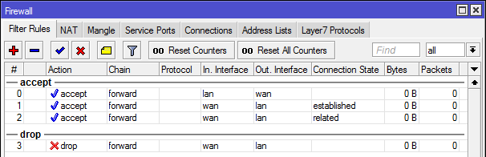

Let's imagine a hypothetical situation. We have a problem with our internet connection, so we call our ISP's tech support. We wait for a couple of minutes to get a free operator, and then we spend fifteen minutes describing the layout of our local network and then another 20 minutes debugging a complex problem (intermittent packet loss when link is not saturated, for example). Finally, the problem seems to be resolved and the operator concludes the call with: _"Should there be any more problems, do not hesitate to contact us again."_

Half an hour later, the problem reappears. We have no other options than to call the ISP's switchboard again, wait for a free operator, who is invariably going to be someone else, describe the problem once again and go through a debugging session once again, repeating the answers to the same questions and so on.

This is the frustration that web-services "feel" each time you connect to them via a NAT gateway. In a situation like the one above, we would like to be able to call the previous operator directly but because we do not know the operator's direct phone number, if there is one, we cannot. *Even though we were given the permission to do so!*

The central point of this article is the old adage, that NAT does not have anything to do with security. Ladies and gentlemen, I present you this:

Even if you use public IP addresses and are thereby connected _"directly to the internet"_, just these 4 rules on a stateful firewall should give you the same degree of protection for the network as a typical consumer-grade NAT implementation. The stateful firewall is called stateful because it maintains some degree of internal state that is used to guide the decisions on what to do with an incoming packet. Let's make a breakdown of these four rules:

1. First rule will accept/let through any packet that goes from the internal network to the internet. While doing so, it will also remember the connection parameters, such as TCP sequence numbers, source and destination IP-port pair, ...
2. Second rule will let trough any packet coming from the internet directed to the internal network IF the connection parameters match one of those that were recorded when packets were going out. Therefore, only if the connection had previously been established from the inside.
3. Third rule will let in any packet that is somehow related to one of the established connections. This rule is not strictly necessary, but it helps with certain applications, such as active-mode FTP that need connections be established from the outside.
4. Fourth rule will drop anything else coming from the internet, such as SYN packets directed towards our internal servers, services running on our workstations, ...

Of course, I will never say that these four rules guarantee network security, as they most certainly do not. Network level security and firewalling are complex topics and much work is needed to render the network fully secure. However, this is the configuration used in many networks, residential and corporate, as it allows full client access to the internet, while blocking any servers from within to serve outside clients. It is a quite restrictive default, but exceptions can easily be made by adding more rules to the firewall.

If you deploy NAT in your network, you will most likely have the above rules configured in the firewall. This is one of the reasons why people consider deploying NAT as adding security to the network. The actual reason for this is of the practical matter. If NAT was not combined with a stateful firewall, it could not work, since it has to keep track of the established sessions in order to know where to forward incoming packets. NAT cannot function without a stateful firewall, whereas the stateful firewall **can and will** function without NAT functionality.

Not using NAT allows us to configure much more fine-grained security at the network perimeter. If we return to the introductory anecdote, we mentioned that we were given the permission to follow-up on the issue. The "phone firewall" in that case could be configured to let in calls from our number to the operator's direct phone number for a specific period of time, afterwards, the access could be blocked. Because NAT-like mechanism is deployed, we cannot do this, because operator does not even have a direct number.

## Appropriate usage of NAT

One may ask themselves when using NAT is in fact appropriate. Apart from stateful firewalling, which is not really a characteristic of NAT at all but more of a side product, NAT mechanisms accomplish two more important things:

- conservation of public IP address space, and
- hiding the details of the internal network (individual computers' IP addresses, subnets, ...)

NAT was invented primarily to address the first bullet point. Beforehand, people were already using stateful firewalls, but in the years to come, NAT has become so prevalent that many people simply could not imagine running their networks on public IPs. The sad truth is, that due to the IPv4 address exhaustion, public IPs everywhere are simply not an option anymore. We will have to live with NAT for as long as we have IPv4, the only thing we want to avoid are things like double-NAT and similar atrocities that unmanageably complicate the network and prevent certain applications from functioning at all.

That being said, we should be aware that IPv6 offers so much address space that the first bullet point is simply not applicable. We will never have to use masquerading to hide multiple IPv6 addresses behind one single address, because there is such an abundance of it. The second bullet point still lurks though, leaving people who are deploying IPv6 in their networks anxious, since their computers are not "hidden" anymore but rather present themselves with an unique address to the whole internet.

This is a typical case of the *security through obscurity* fallacy. Knowing the internal telephone number does not help me at all, because I cannot reach the person unless the operator allows me so when I call the switchboard. Apart from that, there are already mechanisms in place that help providing higher anonymity, such as [IPv6 Privacy Extensions](http://tools.ietf.org/html/rfc4941).

While the classical NAT masquerading that we are familiar with has no place in the IPv6 world, schemes such as NAT66 that provide a one-on-one mapping between public addresses and unique local (ULA) addresses, are marginally effective, especially to facilitate renumbering when a company changes their ISP. Still, deploying any kind of middlebox that changes IP addresses in packets brings about increased complexity, breaks compatibility with certain applications that require Direct connectivity, such as IPsec, while its positive effective are usually negligible.

The verdict would be that while NAT is unavoidable in IPv4 world, we must not fall into temptation and deploy it on IPv6 networks as disadvantages of NAT schemes far outweigh its advantages. IPv6 allows the internet to function as it was originally conceived. As the proverb goes: *When all you have is a hammer, everything starts to look like a nail.* We should not apply the same logic that we have become used to dealing with IPv4 networks as it will only cause us trouble further down the line.
